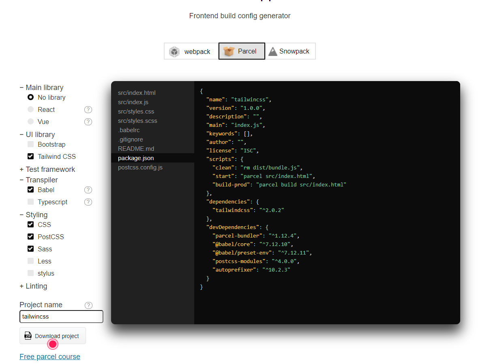

# 收藏样式

## Tailwincss

> https://www.tailwindcss.cn/docs/installation/

工具：https://createapp.dev/parcel

 

勾选需要的依赖，点击下载。

### 安装

```
cd path/to/tailwindcss/
```

```
yarn 
```

```
npx tailwindcss init
```

```
// 运行
npm start
// yarn start
```

如果提示这样的错误

```
D:\laragon\www\Html\tailwincss\src\App.vue:undefined:undefined: PostCSS plugin tailwindcss requires PostCSS 8.
Migration guide for end-users:
https://github.com/postcss/postcss/wiki/PostCSS-8-for-end-users
```

运行一下命令

```bash
npm uninstall tailwindcss postcss autoprefixer

npm install tailwindcss@npm:@tailwindcss/postcss7-compat @tailwindcss/postcss7-compat postcss@^7 autoprefixer@^9
```

或者

```
yarn remove tailwindcss postcss autoprefixer

yarn add tailwindcss@npm:@tailwindcss/postcss7-compat @tailwindcss/postcss7-compat postcss@^7 autoprefixer@^9
```


## 手机弹窗预览内容

```css
.form-pop{
        width: 100%;
        height: 100%;
        background-color: rgba(0,0,0,0.5);
        top: 0;
        left: 0;
        position: fixed;
        z-index: 999;
        display: none;
    }
    .form-pop-con{
        width: 290px;
        height: 590px;
        background-image: url("/static/images/phone.png");
        background-position: center;
        background-size: 100% 100%;
        background-repeat: no-repeat;
        position: absolute;
        top: 50%;
        left: 50%;
        transform: translate(-50%,-50%);
    }
    .form-pop-con-con{
        width: 255px;
        height: 424px;
        /*background-color: #0a001f;*/
        position: absolute;
        top: 97px;
        left: 50%;
        transform: translateX(-50%);
        overflow: auto;
        overflow-x: hidden;
        overflow-y: scroll;
    }
```

```html
<button type="button" id="open-form-pop" class="layui-btn ">预览</button>
<div class="form-pop">
    <div class="form-pop-con">
        <div class="form-pop-con-con">
            <p>
                这里是手机里里面预览的内容
            </p>
        </div>
    </div>
</div>
```

```js
$('#open-form-pop').on('click',function () {
    $('.form-pop').show();
});
$(document).on('click',function () {
    $(".form-pop").hide();
});
$(".form-pop-con").on('click',function () {
    event.stopPropagation();
});
$("#open-form-pop").on('click',function () {
    event.stopPropagation();
});
```

## 图片溢出

```css
#content img{
    max-width: 100%;
}
```

## 文本截断

```css
display:-webkit-box;
-webkit-line-clamp:2;
-webkit-box-orient:vertical;
overflow:hidden;
```

## 水平垂直居中

```css
// .flex-center

display: flex;
align-items: center;
justify-content: center;
```

