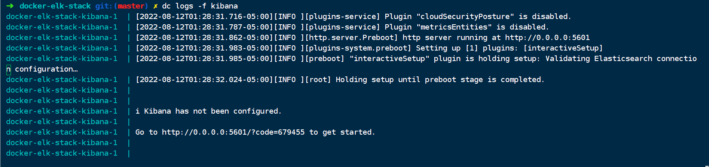
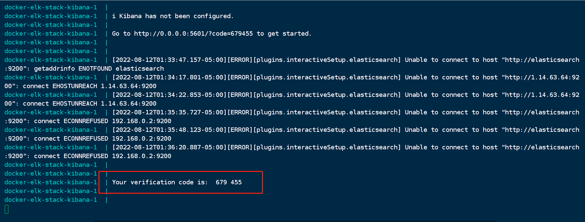

> 版本要一致

# 安装：

```bash
sudo pacman -S elasticsearch
```

# 跨域处理

```bash
sudo -i
cd /etc/elasticsearch
vim elasticsearch.yml
```

添加

```yaml
http.cors.enabled: true
http.cors.allow-origin: "*"
```

启动,默认地址9200

```bash
sudo systemctl start elasticsreach
```

本机运行多个elasticsearch

```
bin/elasticsearch -E node.name=node1 -E cluster.name=orangbus -E path.data=node1_data
bin/elasticsearch -E node.name=node2 -E cluster.name=orangbus -E path.data=node2_data
bin/elasticsearch -E node.name=node3 -E cluster.name=orangbus -E path.data=node3_data
```

删除进程

```bash
ps grep | elasticsearch / kill pid
```

安装可视化工具：elasticsearch-head

# elaticsearch with docker-composer 

```
# .env
# Version of Elastic products
STACK_VERSION=8.5.2
# Password for the 'elastic' user (at least 6 characters)
ELASTIC_PASSWORD=admin666

# Password for the 'kibana_system' user (at least 6 characters)
KIBANA_PASSWORD=admin666

# Set the cluster name
CLUSTER_NAME=docker-cluster

# Set to 'basic' or 'trial' to automatically start the 30-day trial
LICENSE=basic
#LICENSE=trial

# Port to expose Elasticsearch HTTP API to the host
ES_PORT=9200
#ES_PORT=127.0.0.1:9200

# Increase or decrease based on the available host memory (in bytes)
MEM_LIMIT=1073741824
```

```yaml
version: "3.5"

networks:
  backend:
    driver: bridge

volumes:
  es_data:
    driver: local
  kibana_data:
    driver: local

services:
  es:
    image: docker.elastic.co/elasticsearch/elasticsearch:${STACK_VERSION}
    privileged: true
    restart: always
    environment:
      - discovery.type=single-node
      - CLUSTER.NAME=${CLUSTER_NAME}
      - ELASTIC_PASSWORD=${ELASTIC_PASSWORD}
      - "ES_JAVA_OPTS=-Xms512m -Xmx512m"
    volumes:
      - es_data:/usr/share/elasticsearch/data
      - ./elasticsearch/plugins:/usr/share/elasticsearch/plugins
    ports:
      - ${ES_PORT}:9200
      - "9300:9300"
    networks:
      - backend
    mem_limit: ${MEM_LIMIT}
    ulimits:
      memlock:
        soft: -1
        hard: -1
```


# 安装kibana

## 插件

下载插件放到`elasticsreach` 的`plugin` 文件夹即可

## 查看已安装插件

```bash
/bin/elasticsearch-plugin list
```

## 安装插件

```bash
/bin/elasticsearch-plugin install analysis-icu
```


## ik分词器

```json
GET _analyze

{
    "analyzer":"user",
    "text": "orange"
}
```

## 项目升级初探elasticsearch

### 环境准备：

- laradock

- elasticsearch：7.13.2
- ik：7.13.2

修改elasticsearch版本

```bash
vim laradock/.env

ELK_VERSION=7.13.2
```

### 安装ik分词器：

下载ik分词插件到elasticsearch目录：

```bash
cd laradock/elasticsearch/
mkdir plugins
cd plugins && wget https://github.com/medcl/elasticsearch-analysis-ik/archive/refs/tags/v7.13.2.tar.gz
```

修改elasticsearch 的Dockerfile文件

```bash
vim laradock/elasticsearch/Dockerfile
```

```dockerfile
ARG ELK_VERSION=7.13.2
FROM docker.elastic.co/elasticsearch/elasticsearch:${ELK_VERSION}

COPY ./plugins/v7.13.2.tar.gz /usr/share/elasticsearch/plugins

EXPOSE 9200 9300
```

重新buildelasticsearch

```bash
docker-compose build elasticsearch
```

检查是否安装成功

```bash
docker-compose exec elasticsearch /usr/share/elasticsearch/bin/elasticsearch-plugin list
```

### 安装elasticsearch相关的扩展

```bash

```

# curd

## 索引操作（表）

```json
# 创建索引
PUT /jokes

# 获取索引
GET /jokes

# 删除索引
DELETE /jokes

# 关闭索引
POST /jokes/_close

# 开启索引
POST /jokes/_open

# 重建索引
POST _reindex
{
  "source": {
    "index": "jokes2"
  }
}

# 查看所有索引
GET /_cat/indices/?v&pretty


// 查看索引分词


// 设置分片信息
PUT /jokes/_settings
{
  "settings":{
    "number_of_replicas":1
  }
}

// 设置分词器
PUT /jokes
{
  "settings": {
    "index":{
      "anlysis.analyzer.default.type": "ik_max_word"
    }
  }
}
```

## 文档操作（每一条数据）

```
# 添加文档
PUT user/_doc/1
{
  "name":"orangbus",
  "age":18
}

# 编辑文档
POST user/_doc/1
{
  "name":"orangbus",
  "age":20
}

# 查看文档
GET user/_doc/1


# 删除文档
DELETE user/_doc/1

# 文档搜索
GET user/_search
{
  "query": {
    "match": {
      "age": 18
    }
  }
}
```


# 安装kibana


## 插件安装

```bash
bin/kibana-plugin install plugin_location
bin/kibana-plugin list
bin/kibana-plugin remove
```


# Elk环境配置


## Kibana配置

启动

```
dc up -d kibana
```

查看kibaba日志，这个时候会提示你访问 `Go to http://0.0.0.0:5601/?code=679455 to get started` 进行初始化

 

打开浏览器：输入提示的地址：`http://0.0.0.0:5601/?code=679455` 

 

 

这个时候需要进行验证，这里的验证码可以去kibana日志里面去找到

  

 

输入完成后，可能出现一下情况，重启一下整个应用就好了，或者看看是不是因为kibana配置文件没有权限。

 

至此kibaba就配置成功了。


备份

```
version: "3.5"

services:
  elasticsearch:
    image: docker.elastic.co/elasticsearch/elasticsearch:${STACK_VERSION}
    privileged: true
    restart: always
    volumes:
      - ${DATA_PATH_HOST}/elasticsearch:/usr/share/elasticsearch/data:rw
      - ./elasticsearch/plugins:/usr/share/elasticsearch/plugins:rw
    ports:
      - ${ES_PORT}:9200
      - "9300:9300"
    environment:
      - discovery.type=single-node
      - CLUSTER.NAME=${CLUSTER_NAME}
      - ELASTIC_PASSWORD=${ELASTIC_PASSWORD}
      - "ES_JAVA_OPTS=-Xms512m -Xmx512m"
    mem_limit: ${MEM_LIMIT}
    ulimits:
      memlock:
        soft: -1
        hard: -1
```

```
// .env

DATA_PATH_HOST=./data
# Password for the 'elastic' user (at least 6 characters)
ELASTIC_PASSWORD=admin666

# Password for the 'kibana_system' user (at least 6 characters)
KIBANA_PASSWORD=admin666

# Version of Elastic products
STACK_VERSION=8.4.3

# Set the cluster name
CLUSTER_NAME=orangbus

# Set to 'basic' or 'trial' to automatically start the 30-day trial
LICENSE=basic
#LICENSE=trial

# Port to expose Elasticsearch HTTP API to the host
ES_PORT=9200
#ES_PORT=127.0.0.1:9200

# Port to expose Kibana to the host
KIBANA_PORT=5601
#KIBANA_PORT=80

# Increase or decrease based on the available host memory (in bytes)
MEM_LIMIT=1073741824

# Project namespace (defaults to the current folder name if not set)
#COMPOSE_PROJECT_NAME=myproject
```

```
#elasticsearch.yml

cluster.name: "cluster"
network.host: 0.0.0.0
http.cors.enabled: true
http.cors.allow-origin: "*"

xpack:
  license.self_generated.type: basic
  security:
    enabled: true # 开启密码设置为 true
    enrollment:
      enabled: true
```

```
# jvm.options
################################################################
##
## JVM configuration
##
################################################################
##
## WARNING: DO NOT EDIT THIS FILE. If you want to override the
## JVM options in this file, or set any additional options, you
## should create one or more files in the jvm.options.d
## directory containing your adjustments.
##
## See https://www.elastic.co/guide/en/elasticsearch/reference/8.1/jvm-options.html
## for more information.
##
################################################################


################################################################
## IMPORTANT: JVM heap size
################################################################
##
## The heap size is automatically configured by Elasticsearch
## based on the available memory in your system and the roles
## each node is configured to fulfill. If specifying heap is
## required, it should be done through a file in jvm.options.d,
## which should be named with .options suffix, and the min and
## max should be set to the same value. For example, to set the
## heap to 4 GB, create a new file in the jvm.options.d
## directory containing these lines:
##
-Xms200m
-Xmx1G
##
## See https://www.elastic.co/guide/en/elasticsearch/reference/8.1/heap-size.html
## for more information
##
################################################################


################################################################
## Expert settings
################################################################
##
## All settings below here are considered expert settings. Do
## not adjust them unless you understand what you are doing. Do
## not edit them in this file; instead, create a new file in the
## jvm.options.d directory containing your adjustments.
##
################################################################

## GC configuration
8-13:-XX:+UseConcMarkSweepGC
8-13:-XX:CMSInitiatingOccupancyFraction=75
8-13:-XX:+UseCMSInitiatingOccupancyOnly

## G1GC Configuration
# to use G1GC, uncomment the next two lines and update the version on the
# following three lines to your version of the JDK
# 8-13:-XX:-UseConcMarkSweepGC
# 8-13:-XX:-UseCMSInitiatingOccupancyOnly
14-:-XX:+UseG1GC

## JVM temporary directory
-Djava.io.tmpdir=${ES_TMPDIR}

## heap dumps

# generate a heap dump when an allocation from the Java heap fails; heap dumps
# are created in the working directory of the JVM unless an alternative path is
# specified
-XX:+HeapDumpOnOutOfMemoryError

# exit right after heap dump on out of memory error. Recommended to also use
# on java 8 for supported versions (8u92+).
9-:-XX:+ExitOnOutOfMemoryError

# specify an alternative path for heap dumps; ensure the directory exists and
# has sufficient space
-XX:HeapDumpPath=data

# specify an alternative path for JVM fatal error logs
-XX:ErrorFile=logs/hs_err_pid%p.log

## GC logging
-Xlog:gc*,gc+age=trace,safepoint:file=logs/gc.log:utctime,pid,tags:filecount=32,filesize=64m

```

elaticsearch + kibana

```yaml
version: "3.0"
services:
  elasticsearch:
    container_name: es-container
    image: docker.elastic.co/elasticsearch/elasticsearch:7.11.0
    environment:
      - xpack.security.enabled=false
      - "discovery.type=single-node"
    networks:
      - es-net
    ports:
      - 9200:9200
  kibana:
    container_name: kb-container
    image: docker.elastic.co/kibana/kibana:7.11.0
    environment:
      - ELASTICSEARCH_HOSTS=http://es-container:9200
    networks:
      - es-net
    depends_on:
      - elasticsearch
    ports:
      - 5601:5601
networks:
  es-net:
    driver: bridge
```
