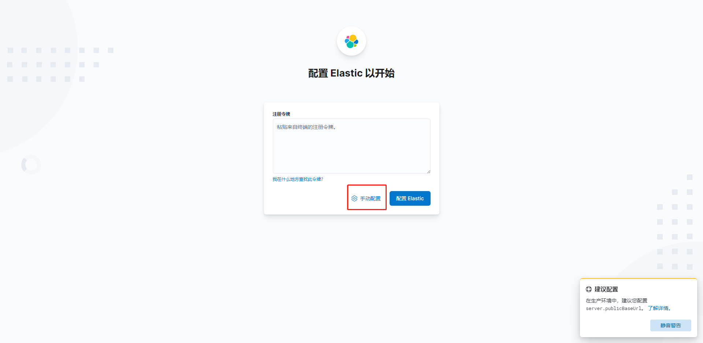

> 版本要一致

安装：

```bash
sudo pacman -S elasticsearch
```

## 跨域处理

```bash
sudo -i
cd /etc/elasticsearch
vim elasticsearch.yml
```

添加

```yaml
http.cors.enabled: true
http.cors.allow-origin: "*"
```

启动,默认地址9200

```bash
sudo systemctl start elasticsreach
```

安装可视化工具：elasticsearch-head


安装kibana

## 插件

下载插件放到`elasticsreach` 的`plugin` 文件夹即可

## ik分词器

```json
GET _analyze

{
    "analyzer":"user",
    "text": "orange"
}
```

## 项目升级初探elasticsearch

### 环境准备：

- laradock

- elasticsearch：7.13.2
- ik：7.13.2

修改elasticsearch版本

```bash
vim laradock/.env

ELK_VERSION=7.13.2
```

### 安装ik分词器：

下载ik分词插件到elasticsearch目录：

```bash
cd laradock/elasticsearch/
mkdir plugins
cd plugins && wget https://github.com/medcl/elasticsearch-analysis-ik/archive/refs/tags/v7.13.2.tar.gz
```

修改elasticsearch 的Dockerfile文件

```bash
vim laradock/elasticsearch/Dockerfile
```

```dockerfile
ARG ELK_VERSION=7.13.2
FROM docker.elastic.co/elasticsearch/elasticsearch:${ELK_VERSION}

COPY ./plugins/v7.13.2.tar.gz /usr/share/elasticsearch/plugins

EXPOSE 9200 9300
```

重新buildelasticsearch

```bash
docker-compose build elasticsearch
```

检查是否安装成功

```bash
docker-compose exec elasticsearch /usr/share/elasticsearch/bin/elasticsearch-plugin list
```

### 安装elasticsearch相关的扩展

```bash

```

# curd

## 索引操作（数据库）

```json
```

## 文档操作（表）

```
# 查看索引
GET user

# 创建索引
PUT user

# 删除索引
DELETE user


# 添加文档
PUT user/_doc/1
{
  "name":"orangbus",
  "age":18
}

# 编辑文档
POST user/_doc/1
{
  "name":"orangbus",
  "age":20
}

# 查看文档
GET user/_doc/1


# 删除文档
DELETE user/_doc/1

# 文档搜索
GET user/_search
{
  "query": {
    "match": {
      "age": 18
    }
  }
}
```


# Elk环境配置


## Kibana配置

启动

```
dc up -d kibana
```

查看kibaba日志，这个时候会提示你访问 `Go to http://0.0.0.0:5601/?code=679455 to get started` 进行初始化

 

打开浏览器：输入提示的地址：`http://0.0.0.0:5601/?code=679455` 

 

 

这个时候需要进行验证，这里的验证码可以去kibana日志里面去找到

  

 

输入完成后，可能出现一下情况，重启一下整个应用就好了，或者看看是不是因为kibana配置文件没有权限。

 

至此kibaba就配置成功了。
