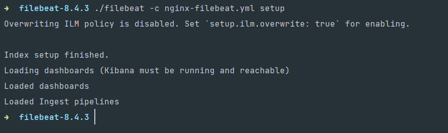
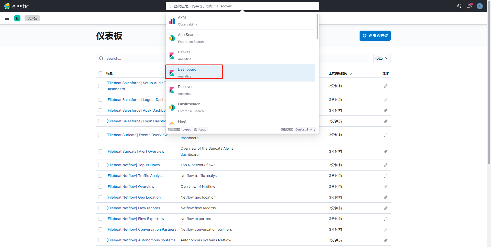
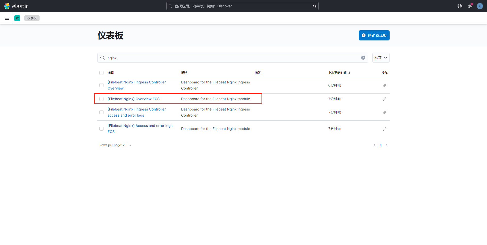
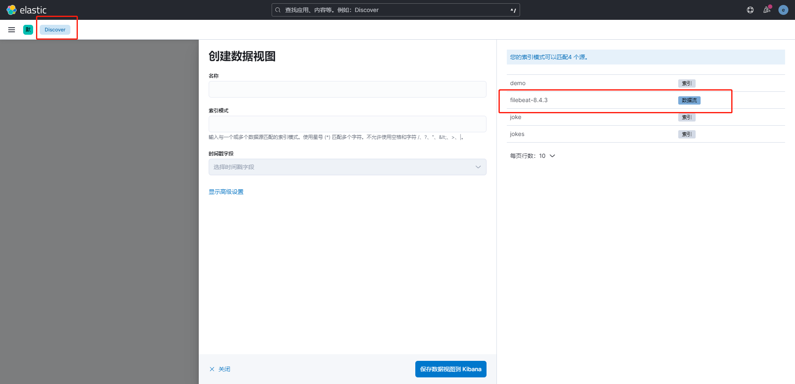
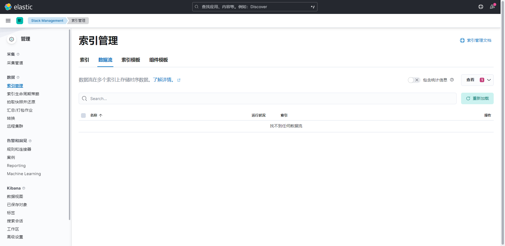

源码方式使用

下载相同版本的源码包: `8.2.3` 

下载地址： [https://www.elastic.co/cn/downloads/](https://www.elastic.co/cn/downloads/) 

```
├── elasticsearch-8.2.3-linux-x86_64.tar.gz
├── elasticsearch-analysis-ik-8.2.3.zip
├── filebeat-8.2.3-linux-x86_64.tar.gz
├── kibana-8.2.3-linux-x86_64.tar.gz
├── logstash-8.2.3-linux-x86_64.tar.gz
├── logstash-filter-geoip-7.2.12.tar.gz
└── metricbeat-8.2.3-linux-x86_64.tar.gz
```

# Elasticsearch

解压

```bash
tar -zxvf Package/elasticsearch-8.2.3-linux-x86_64.tar.gz -C ./
```

修改配置：`elasticsearch.yml`

```yml
cluster.name: elasticsearch
node.name: master
network.host: 0.0.0.0
http.port: 9200
cluster.initial_master_nodes: ['mster']
```

修改配置: `/etc/systemctl.conf`

```
vm.max_map_count=655360
```

启动

```bash
./es/bin/elasticsearch
```

访问：`http://localhost:9200` 

## elasticsearch设置用户密码

1、修改 `elasticsearch.yml` 文件

```yaml
xpack:
  license.self_generated.type: basic
  security:
    enabled: true # 开启密码设置为 true
    enrollment:
      enabled: true
  transport:
   	 ssl:
   	   enabled: false
```

2、执行设置用户名和密码的命令,这里需要为4个用户分别设置密码，elastic, kibana, logstash_system,beats_system

```bash
./bin/elasticsearch-setup-passwords auto
```

3，修改密码命令如下

```bash
curl -H "Content-Type:application/json" -XPOST -u elastic 'http://127.0.0.1:9200/_xpack/security/user/elastic/_password' -d '{ "password" : "new password" }'
```

## 忘记密码

进入docker环境中，创建一个 超级用户 ：admin

```bash
./bin/elasticsearch-users useradd admin -r superuser
```

用这个用户去修改elastic的密码：

```bash
curl -XPUT -u admin:admin666 http://localhost:9200/_xpack/security/user/elastic/_password -H "Content-Type: application/json" -d '
{
  "password": "new password"
}'
```

# 

# filebeat

日志文件（收集文件数据）

```yml
filebeat.prospectors: 
 - input_type: log
   paths:
  - /nginx/*.log
  - /mysql/*.log
 - input_type: stdin # 标椎输入
   paths:
   - /redis/*.log
   
output.console:
  pretty: true
  
output.elasticsearch:
 hosts: ["127.0.0.1:9200"]
 username: "admin"
 password: "admin666"
```


## 安装

下载解压即可，已下操作都是在filebeat目录下进行操作

```bash
tar -zxvf filebeat-8.4.3-linux-x86_64.tar.gz
cd filebeat-8.4.3-linux-x86_64/
```

## 初体验

读取一个文件在终端中输出

配置文件

```yaml
demo.yaml

filebeat.inputs:
  - type: stdin
    enabled: true
setup.template.settings: # 保存到es中的一个副本的数量
    index.number_of_shards: 1
    
output.console:
    pretty: true
    enable: true
```

运行

```bash
./filebeat -e -c demo.yaml
```

## 读取日志文件

创建一个日志文件

```
mkdir Logs

touch nginx.log
```

创建一个 `nginx-log.yml` 文件

```yaml
# nginx-log.yml

filebeat.inputs: # 这里是inputs
  - type: log # 类型是 日志类型
    enabled: true
    paths:
      - /path/to/logs/*.log
    fileds: # 添加自定义字段
      from: nginx-log
    fileds_under_root: true # 添加到根节点，false：添加到子节点
setup.template.settings:
  index.number_of_shards: 3
 
# 输出到终端
output.console:
  pretty: true
  enable: true
```

启动

```bash
./filebeat -e- c filebeat-log.yaml
```

/path/to/logs/a.log

```
hello
world
```

## 输出到elasticsearch中

```yaml
# filebeat-nginx.yaml
filebeat.input:
  - type: log
    enabled: true
    paths:
      - /path/to/logs/*.log
    tags: ["nginx","log"]
    fileds:
      from: "nginx-log"
      fields_under_root: false
setup.template.settings:
  index.number_of_shards: 3

# 输入到es中
output.elasticsearch: # 制定es的配置
  hosts: ["127.0.0.1:9200"]
  username: ""
  password: ""
 
# 输出到 kibana 汇总
setup.kibana:
  host: "kibana_host:5601"
```

启动

```bash
./filebeat -e- c filebeat-nginx.yaml
```

## 实战演示

将宝塔中nginx的日志通过filebeat 输出到 elasticsearch中，并用kibana展示出来。

### 1、开启nginx modules

```bash
./filebeat modules enable nginx

# 列表
./filebeat modules list

# 开启禁用
./filebeat modules enable|disable nginx
```

### 3、填写配置nginx日志路径

```bash
vim cd modules.d/nginx.yml
```

```yaml
# Module: nginx
# Docs: https://www.elastic.co/guide/en/beats/filebeat/8.4/filebeat-module-nginx.html

- module: nginx
  # Access logs
  access:
    enabled: true
    # nginx access_log 的绝对路径,可填写多个
    var.paths: ["/home/orangbus/Docker/Logs/deepin.com.log"]

  # Error logs
  error:
    enabled: false
    # 同上配置
    #var.paths:

  ingress_controller:
    enabled: false

    #var.paths:
```

### 3 、配置 filebeat-nginx.yml 

参考地址：[https://www.elastic.co/guide/en/beats/filebeat/current/setup-kibana-endpoint.html](https://www.elastic.co/guide/en/beats/filebeat/current/setup-kibana-endpoint.html)  

创建一个 `nginx-filebeat.yml` 配置 (复制一份默认的进行修改)

```shell
cp cp filebeat.yml nginx-filebeat.yml
```

```yaml
filebeat.input:

setup.template.settings:
  index.number_of_shards: 1
  
# kibana 配置
setup.kibana:
  host: "localhost:5601"
  protocol: "http"
  username: "elastic"
  password: "cy2ZEszz8EP0gPy6hi9L"

# elasticsearch的配置
output.elasticsearch: 
  hosts: ["127.0.0.1:9200"]
  username: "elastic"
  password: "93Wzawo0wunszVmc1gwa"
```

可能需要安装两个`elasticsearch`扩展包

```bash
sudo bin/elasticsearch-plugin install ingest-user-agent
sudo bin/elasticsearch-plugin install ingest-geoip
```

### 4、安装仪表盘到kibana中

```bash
./filebeat -c nginx-filebeat.yml setup
```

  

### 5、运行

```bash
./filebeat -e- c nginx-filebeat.yml

// 后台启动
./filebeat -e- c nginx-filebeat.yml  2>&1 >/dev/null &

// 查看
ps -ef | grep filebeat
```

### 6、kibana查看数据

在kibana中会多出几个视图，即表示安装成功

 

搜索nginx 

 

---


# kibann 配置filebeat

 


## 问题汇总

### 无法删除 filebeat 的index

进入kibana，删除 filebeat的数据流

 

### 如何从头开始读取

删除 filebeat目录下的 `./data/registry` 文件内容即可

```bash
rm -rf ./data/registry
```


# Logstash

对提交的数据进行清洗

**input** 

- file
- redis
- beat

**filter** 

- grok：正则表达式，可将非机构化的数据转化为结构化的数据
- mutate ：数据增删改查
- drop：删除
- date ： 将字符串类型的时间字段转化为时间戳类型，方便后续数据处理

**out**

- stdout
- elasticsearch


基本配置

```
input {
  beats {
    port => 5044   
  }
}
output {
  elasticsearch {
    hosts => ["http://192.168.110.130:9200"] #这里可以配置多个
    index => "query-%{yyyyMMdd}" 
  }
}

```


# Metricbeat

指标（收集系统、进程和文件系统级别的CPU和内存使用情况等数据）

module : ningx

metricset: cpu memory network


redis-cli  info

修改es的链接


启动

```bash
./metricbeat -e

# 后台运行
./metricbeat -e >/dev/null 2>&1 &

#查看
fg

# 放入后台
ctrl +z
```


开启nginx的状态查询

```bash
./configure --prefix=/usr/local/nginx --with-http_stub_status_module
```

## 配置 nginx 状态统计

```nginx
location /nginx-status {
    stub_status on;
    access_log off;
}
```

启用nginx modules

```bash
./metricbeat modules enable|disable nginx
```

配置nginx module 地址 `modules.d/nginx.yml`

```yaml
hosts: ["http://localhost"]
server_status_path: "nginx-status" // nginx 配置的状态查询一致
```

metricbeat配置kibana

```yml
setup.kibana:
	host:"kibana_host:5601"
```

metricbeat 安装仪表盘到kibana

```bash
./metricbeat setup
```


常见的状态

| 名称                             | 示例 | 备注 |
| -------------------------------- | ---- | ---- |
| agent.hostname                   |      |      |
| log.file.path ：日志文件路径     |      |      |
| source.ip ：来源ip               |      |      |
| http.request.method              |      |      |
| user_agent.name 系统名称         |      |      |
| user_agent_os.version  系统版本  |      |      |
| user_agent.devive.name  设备名称 |      |      |
|                                  |      |      |
|                                  |      |      |


# Kibana配置账号密码

  在 `kibana.yml`中配置用户名和密码

```yml
elasticsearch.username: "kibana"
elasticsearch.password: "*****"
```

  账号密码为 `es初始化中设置的密码` elastic

  重启kibana

  输入http://ip:5601打开登录页面，使用elastic账号登录，并在角色和用户管理中添加用户指定 索引用于访问ES.

# Logstash配置账号密码

在logstash.yml中配置用户名和密码

```yml
xpack.monitoring.enabled: true
xpack.monitoring.elasticsearch.username: logstash_system
xpack.monitoring.elasticsearch.password: *****
xpack.monitoring.elasticsearch.hosts: ["http://ip:9200"]
```

Api访问

  http请求方式，在请求链接中添加账号和密码，注:密码中不要带@。

  http://{userName}:{passwords}@ip:port


# logstash同步mysql 到es

```
# Sample Logstash configuration for creating a simple
# Beats -> Logstash -> Elasticsearch pipeline.

input {
  jdbc {
    jdbc_driver_library => "/home/orangbus/Code/Docker/Elk/Package/mysql-connector-java-8.0.28.jar"
    jdbc_driver_class => "com.mysql.cj.jdbc.Driver"
    jdbc_connection_string => "jdbc:mysql://127.0.0.1:3306/laravel9"
    jdbc_user => "root"
    jdbc_password => "root"
    jdbc_page_size => "1000"
    schedule => "* * * * *"
    statement => "SELECT * FROM brain_teasers WHERE updated_at >= :sql_last_value"
    use_column_value => true
    tracking_column_type => "timestamp"
    tracking_column => "updated_at"
#    last_run_metadata_path => "syncpoint_table"
  }
}

  output {
#    elasticsearch {
#      hosts => ["http://localhost:9200"]
#      index => "%{[@metadata][beat]}-%{[@metadata][version]}-%{+YYYY.MM.dd}"
      #user => "elastic"
      #password => "changeme"
#  }
  stdout {
    codec => json_lines
  }
  
}

```

- `jdbc_driver_library`: jdbc mysql 驱动的路径，在上一步中已经下载
- `jdbc_driver_class`: 驱动类的名字，mysql 填 `com.mysql.jdbc.Driver` 就好了
- `jdbc_connection_string`: mysql 地址
- `jdbc_user`: mysql 用户
- `jdbc_password`: mysql 密码
- `schedule`: 执行 sql 时机，类似 crontab 的调度
- `statement`: 要执行的 sql，以 ":" 开头是定义的变量，可以通过 parameters 来设置变量，这里的 `sql_last_value` 是内置的变量，表示上一次 sql 执行中 update_time 的值，这里 `update_time` 条件是 `>=` 因为时间有可能相等，没有等号可能会漏掉一些增量
- `use_column_value`: 使用递增列的值
- `tracking_column_type`: 递增字段的类型，`numeric` 表示数值类型, `timestamp` 表示时间戳类型
- `tracking_column`: 递增字段的名称，这里使用 update_time 这一列，这列的类型是 `timestamp`
- `last_run_metadata_path`: 同步点文件，这个文件记录了上次的同步点，重启时会读取这个文件，这个文件可以手动修改


- `hosts`: es 集群地址
- `user`: es 用户名
- `password`: es 密码
- `index`: 导入到 es 中的 index 名，这里我直接设置成了 mysql 表的名字
- `document_id`: 导入到 es 中的文档 id，这个需要设置成主键，否则同一条记录更新后在 es 中会出现两条记录，`%{id}` 表示引用 mysql 表中 `id` 字段的值


启动

```bash
./bin/logstash -f config/mysql.yml
```


