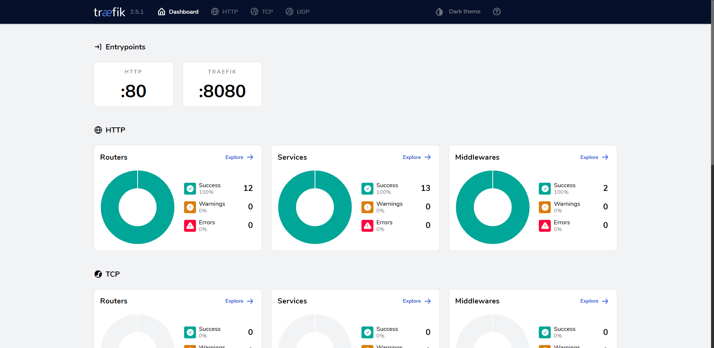
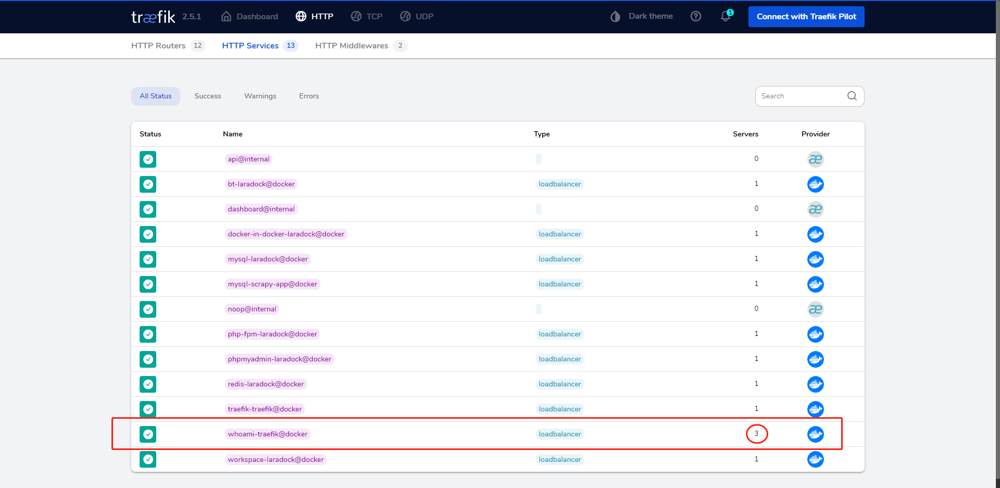

# traefik是什么？

- 类似nginx的反向代理的工具
- 好处：百度一下
- 坏处：百度一下

## 前提

> 首先安装好 docker 以及 docker-compose
>
> 我的服务器ip是：192.168.3.14
>
> 本机的ip地址：192.168.3.35

## 安装

首先任意找到一个`空文件夹`，创建一个`docker-compose-yaml` 文件

```yaml
version: '3.5'
services:
  traefik:
    image: traefik
    command: --api.insecure=true --providers.docker # 启用webUI 并告诉Traefile去监听docker的容器实例
    ports:
      - 80:80 # 宿主机（本机暴露端口）：容器内部的端口，一般是默认的，不要随意改动
      - 8008:8080  # webUI暴露的端口(必须制定--api.insecure=true才可以访问)
    volumes:
      # 指定docker的sock文件来让traefik获取docker的事件，从而实现动态负载均衡
      - /var/run/docker.sock:/var/run/docker.sock

  whoami:
    image: containous/whoami
    labels:
      - "traefik.http.routers.whoami.rule=Host(`whoami.test`)"
```

说明：

`whoami.test `  假如我们访问 `whoami.test` 指向的是 `whoami` 这个服务(留意下面的whoami操作)。

## 启动

```bash
docker-compose up -d
```

## 查看

```bash
docker-compose ps
==========
➜  docker-compose ps
traefik_traefik_1   /entrypoint.sh --api.insec ...   Up      0.0.0.0:80->80/tcp,:::80->80/tcp, 0.0.0.0:8008->8080/tcp,:::8008->8080/tcp
traefik_whoami_1    /whoami                          Up      80/tcp
```

如果两个服务都是 `up` 状态及表示安装成功。

## 查看traefik后台

浏览器访问：ip:8008

 

# 如何通过traefik访问whoami

首先在本机的 `hosts` 文件中添加一个解析指向服务器的traefik

```text
192.168.3.14 whoami.test
```

我们直接通过`本机` 浏览器访问：whoami.test , 即可访问到 `whoami` 这个服务了。

# 如何提现出他的负载均衡呢？

在我们的 `docker-compose.yaml` 文件中，我们并没有给`whoami`暴露端口给外界访问，所以不会存在端口冲突问题，此时我们可以将`whoami` 这个服务扩展到3个

```
docker-compose up -d --scale whoami=3
```

 

多次刷新：`whoami.test` ，你会发现，whoami 的 `Hostname` 名字是动态变化的，也就是说`whoami`现在已经实现了负载均衡。

简单的traefik入门就到这里，欢迎大家加入我们的交流群一起讨论。