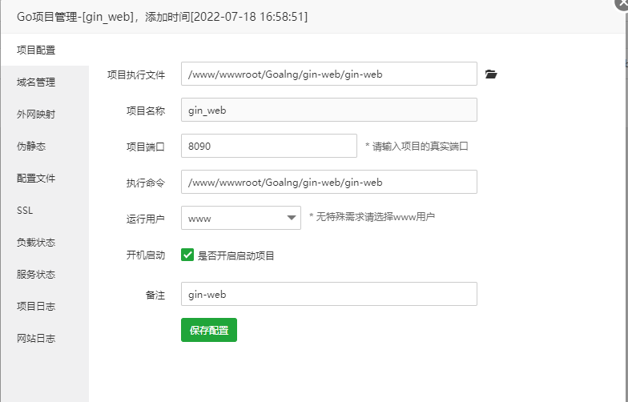

# 获取请求参数

##  1、直接获取

```go
name := c.PostForm("name")
phone := c.PostForm("phone")
password := c.PostForm("password")
```

## 2、使用map 接受参数

```go
var requestmap = make(map[string]string)
json.NewDecoder(c.Request.Body).Decode(requestmap)

name
```

## 3、gin框架自带的绑定

```go
var requestmap = model.User{}
c.Bind(&requestmap)
name := requestmap.Name
phone := requestmap.Phone
password := requestmap.Password
```

# viper-读取配置文件

[https://github.com/spf13/viper](https://github.com/spf13/viper)

```bash
go get github.com/spf13/viper
```

## 配置文件

```yaml
// application.yaml
server:
  port : 8080
  
database:
  drive: "mysql"
  host: "127.0.0.1"
  port: 3306
  database: "gin_web"
  username: "root"
  password: "root"
  charset: "utf8mb4"

```

## 配置文件读取

```go
func initConfig() {
	workDir, _ := os.Getwd()
	viper.SetConfigName("application")
	viper.SetConfigType("yaml")
	viper.AddConfigPath(workDir + "/config")
	err := viper.ReadInConfig()
	if err != nil {
		fmt.Println(err)
		panic("配置读取失败:")
	}
}
```

## 获取配置

```go
viper.GetString("server.port")
```

# go-jwt 

[https://github.com/dgrijalva/jwt-go](https://github.com/dgrijalva/jwt-go) 

```bash
go get github.com/dgrijalva/jwt-go
```

## 生成token

```go
```


## 解析token

```go
```


## token过期判断

```go
```

# 项目部署

1、下载源代码

2、打包文件

```bash
go build
```

3、启动可执行文件

```
./gin_web
```

直接访问ip和端口即可，如果需要绑定域名，需要借助nginx的端口转发，也就是将域名绑定的80端口 转发到 项目的访问端口。

宝塔项目配置案例

 