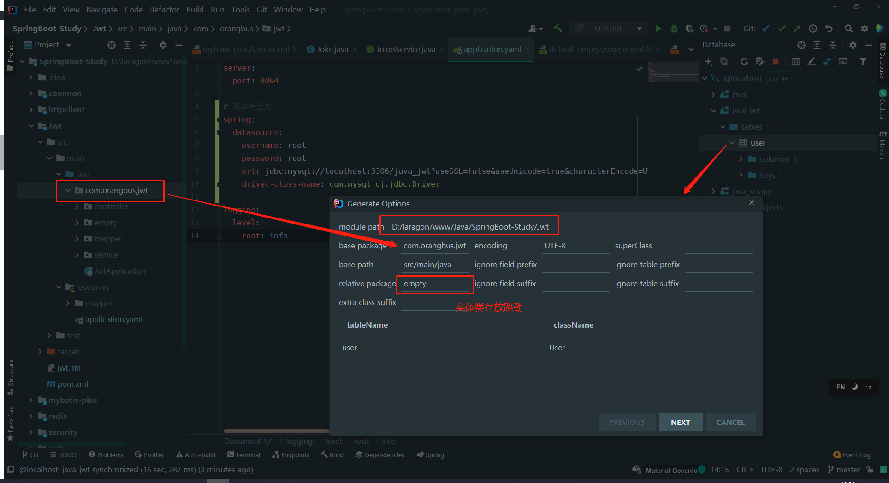
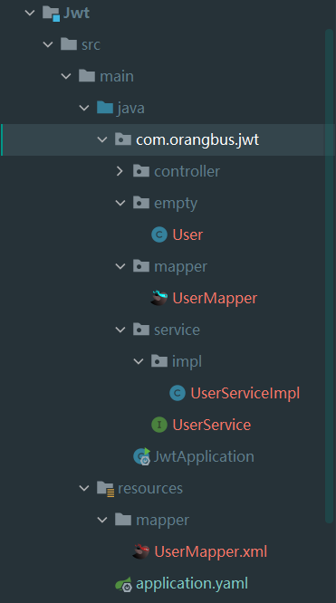

# 数据库连接

```xml
 <bean id="dataSource" class="org.springframework.jdbc.datasource.DriverManagerDataSource">
        <property name="driverClassName" value="com.mysql.cj.jdbc.Driver" />
        <property name="url" value="jdbc:mysql://localhost/spring_jdbc?useUnicode=true&amp;characterEncode=UTF-8" />
        <property name="username" value="root" />
        <property name="password" value="root" />
    </bean>
```

properties配置

```properties
spring.datasource.username=root
spring.datasource.password=root
spring.datasource.url=jdbc:mysql://localhost:3306/mybatis-plus?useSSL=false&useUnicode=true&characterEncode=UTF-8&serverTimezone=GMT
spring.datasource.driver-class-name=com.mysql.cj.jdbc.Driver
```

东八区时间设置

```properties
serverTimezone=GMT%2b8
```

yaml配置

```yaml
server:
  port: 8090

# 数据库连接
spring:
  datasource:
    username: root
    password:
    url: jdbc:mysql://localhost:3306/java?useSSL=false&useUnicode=true&characterEncode=UTF-8&serverTimezone=GMT
    driver-class-name: com.mysql.cj.jdbc.Driver
```


# spring-jdbc

1、maven引入`spring-jdbc` 

```xml
<dependency>
    <groupId>org.springframework</groupId>
    <artifactId>spring-jdbc</artifactId>
    <version>5.3.9</version>
</dependency>
<dependency>
    <groupId>mysql</groupId>
    <artifactId>mysql-connector-java</artifactId>
    <version>8.0.25</version>
</dependency>
```

2、`applicationContext.xml` 配置`DataSource`数据源

```xml-dtd
<?xml version="1.0" encoding="UTF-8"?>
<beans xmlns="http://www.springframework.org/schema/beans"
       xmlns:xsi="http://www.w3.org/2001/XMLSchema-instance"
       xmlns:context="http://www.springframework.org/schema/context"
       xsi:schemaLocation="http://www.springframework.org/schema/beans http://www.springframework.org/schema/beans/spring-beans.xsd">

    <!--默认本地数据库配置-->
    <bean id="dataSource" class="org.springframework.jdbc.datasource.DriverManagerDataSource">
        <property name="driverClassName" value="com.mysql.cj.jdbc.Driver"/>
        <property name="url" value="jdbc:mysql://localhost/spring_jdbc?useUnicode=true&amp;characterEncode=UTF-8"/>
        <property name="username" value="root"/>
        <property name="password" value="root"/>
    </bean>

    <!--家里数据库配置 -->
    <bean id="home" class="org.springframework.jdbc.datasource.DriverManagerDataSource">
        <property name="driverClassName" value="com.mysql.cj.jdbc.Driver"/>
        <property name="url" value="jdbc:mysql://192.168.3.219:3306/mybatis?useUnicode=true&amp;characterEncode=UTF-8"/>
        <property name="username" value="root"/>
        <property name="password" value="root"/>
    </bean>

    <!--创建数据库连接，JdbcTemplate提供curd的api-->
    <bean id="jdbcTemplate" class="org.springframework.jdbc.core.JdbcTemplate">
        <!--dataSource写死的-->
        <property name="dataSource" ref="home"/>
    </bean>
    <!--为jdbc连接数据库-->
    <bean id="employeeDao" class="com.orangbus.jdbc.dao.Employee">
        <property name="jdbcTemplate" ref="jdbcTemplate"/>
    </bean>

</beans>
```

3、在Dao注入`jdbcTemplate` 对象，实现数据的CURD


# Mybatis开发步骤

1、引入mybatis依赖

2、创建核心配置文件

3、创建实体类Entity

4、创建Mapper映射文件

5、初始化SessionFactory

6、利用sqlSession对象操作数据库


日志配置


动态sql处理


缓存


连表查询


分页


# 单元测试-JUnit4

```xml
```

配置

```java
```

# mybatis-plus

官网：[https://baomidou.com/guide/install.html#release](https://baomidou.com/guide/install.html#release) 

代码生成插件：mybatisx | MyBatis Generator | Free MyBatis plugin

## 常用注解

@Repository 标识持久层


循环输出

```java
userLists.forEach(System.out::printLn);
```


## mybatisx使用技巧

1、首先链接上数据库

2、使用 `idea` 连接上数据库

3、点击对应的表生成相应的代码

 

 


## 1、导入依赖

```xml
<dependency>
    <groupId>mysql</groupId>
    <artifactId>mysql-connector-java</artifactId>
</dependency>
<dependency>
    <groupId>org.projectlombok</groupId>
    <artifactId>lombok</artifactId>
</dependency>
<dependency>
    <groupId>org.springframework.boot</groupId>
    <artifactId>spring-boot-starter-test</artifactId>
    <scope>test</scope>
</dependency>
<dependency>
    <groupId>com.baomidou</groupId>
    <artifactId>mybatis-plus-boot-starter</artifactId>
    <version>3.0.5</version>
</dependency>
<dependency>
    <groupId>com.h2database</groupId>
    <artifactId>h2</artifactId>
    <scope>runtime</scope>
</dependency>
```

## 2、数据库连接

> src/main/sources/application.yaml

```yaml
server:
  port: 8090

# 数据库连接
spring:
  datasource:
    username: root
    password:
    url: jdbc:mysql://localhost:3306/java?useSSL=false&useUnicode=true&characterEncode=UTF-8&serverTimezone=Asia/Shanghai
    driver-class-name: com.mysql.cj.jdbc.Driver
```

```
serverTimezone=Asia/Shanghai // 北京时间
serverTimezone=UTC // 全球标准时间
serverTimezone=GMT //
```

## 3、启动类中添加mapper扫描

```java
@MapperScan("com.orangbus.video.dao")
```

## 配置日志

```properties
# 日志配置
mybatis-plus.configuration.log-impl=org.apache.ibatis.logging.stdout.StdOutImpl
```

## 表配置

### 自动生成id处理（雪花算法）

```java
@TableId(value="id" , type = IdType.AUTO)
private Long id;
```

### 自动时间处理

```java
@TableField(fill = FieldFill.INSERT)
private Date createTime;

@TableField(fill = FieldFill.INSERT_UPDATE)
private Date updateTime;
```

```java
package com.orangbus.mybatisplus.handler;

import com.baomidou.mybatisplus.core.handlers.MetaObjectHandler;
import org.apache.ibatis.reflection.MetaObject;
import org.springframework.stereotype.Component;

import java.util.Date;

/**
 * 插入更新数据自动填充创建时间和更新时间
 */
@Component
public class AutoDataFill implements MetaObjectHandler {
    @Override
    public void insertFill(MetaObject metaObject) {
        this.setFieldValByName("createdAt",new Date(),metaObject);
        this.setFieldValByName("updatedAt",new Date(),metaObject);
    }

    @Override
    public void updateFill(MetaObject metaObject) {
        this.setFieldValByName("updatedAt",new Date(),metaObject);
    }
}
```

### 时间格式化

```java
// 时间格式化
@JsonFormat(pattern = "yyyy-MM-dd HH:mm:ss", timezone="GMT+8")
// json返回格式化
// @JsonProperty("created_at")
// 自动填充
@TableField(fill = FieldFill.INSERT)
private Date createdAt;
```

### 相关注解

```java
@Data
@AllArgsConstructor
@NoArgsConstructor
@ToString
@Accessors(chain = true)
```

临时字段

```java
@TableField(exsit=false)
private String userName;
```


## CRUD

controller：接受请求参数，返回数据

empty：数据库表字段对应

Service：具体的业务实现

resources/mapper：数据库查询

接口+继承的方式

流程：controlloer -> service->mapper实现类

### 查询

```java
@Test
void testSeleteOne(){
    JokeCates jokeCates = jokeCatesDao.selectById(1);
    System.out.println(jokeCates);
}
```


### 添加

```java
@Test
void testInsert(){
    JokeCates jokeCates = new JokeCates();
    jokeCates.setName("mybatis");
    jokeCates.setSort(0);
    jokeCates.setFromName("mybatis");
    //        jokeCates.setCreatedAt(new Date());
    //        jokeCates.setUpdatedAt(new Date());

    int count = jokeCatesDao.insert(jokeCates);
    System.out.println(count);
    System.out.println(jokeCates);
}
```


### 分页查询

```java
package com.orangbus.mybatisplus.config;

import com.baomidou.mybatisplus.extension.plugins.PaginationInterceptor;
import com.baomidou.mybatisplus.extension.plugins.pagination.optimize.JsqlParserCountOptimize;
import org.mybatis.spring.annotation.MapperScan;
import org.springframework.context.annotation.Bean;
import org.springframework.context.annotation.Configuration;
import org.springframework.transaction.annotation.EnableTransactionManagement;

@Configuration
@EnableTransactionManagement //事务管理
@MapperScan("com.orangbus.mybatisplus.dao")
public class PageConfig {
    @Bean
    public PaginationInterceptor paginationInterceptor(){
        PaginationInterceptor paginationInterceptor = new PaginationInterceptor();
        // 设置请求的页面大于最大页后操作， true调回到首页，false 继续请求  默认false
        // paginationInterceptor.setOverflow(false);
        // 设置最大单页限制数量，默认 500 条，-1 不受限制
        // paginationInterceptor.setLimit(500);
        // 开启 count 的 join 优化,只针对部分 left join
        paginationInterceptor.setCountSqlParser(new JsqlParserCountOptimize(true));
        return paginationInterceptor;
    }

}
```


```java
@Test
public void pageList(){
    QueryWrapper<JokeCates> wrapper = new QueryWrapper<>();
    // 查询条件
    wrapper.eq("name","orangbus");
    IPage<JokeCates> ipage = new Page<>(1, 15);
    IPage<JokeCates> lists = jokeCatesDao.selectPage(ipage, wrapper);
    List<JokeCates> records = lists.getRecords();
    records.forEach(System.out::println);
    System.out.println(lists.getSize());
}
```


### 更新

```java
@Test
public void update(){
    JokeCates jokeCate = new JokeCates();
    jokeCate.setId(101L);
    jokeCate.setFromName("我来自orangbus");
    int count = jokeCatesDao.updateById(jokeCate);
    System.out.println(count);
}
```


### 删除

```java
@Test
public void delete(){
    int count = jokeCatesDao.deleteById(102L);
    System.out.println(count);
}
```

## 完整案例

```java
package com.orangbus.springbootmybatisplus.controller;

import com.baomidou.mybatisplus.core.conditions.query.QueryWrapper;
import com.baomidou.mybatisplus.core.conditions.update.UpdateWrapper;
import com.orangbus.springbootmybatisplus.common.ApiResponse;
import com.orangbus.springbootmybatisplus.empty.ArticleCates;
import com.orangbus.springbootmybatisplus.mapper.ArticleCatesMapper;
import com.orangbus.springbootmybatisplus.paramArgs.ArticleCateParam;
import org.springframework.beans.factory.annotation.Autowired;
import org.springframework.web.bind.annotation.*;

import java.util.Date;
import java.util.List;

@RestController
public class Index {

    @Autowired
    private ArticleCatesMapper articleCatesMapper;

    @GetMapping("/")
    public ApiResponse index(){
        ArticleCates articleCates = articleCatesMapper.selectById(27);
        return ApiResponse.success(articleCates);
    }
    @PostMapping("create")
    public ApiResponse create(
            @RequestParam("name") String name,
            @RequestParam(value = "from_name",defaultValue = "我是默认值") String from_name,
            @RequestParam int sort
    ){
        ArticleCates cates = new ArticleCates();
        cates.setName(name);
        cates.setFromName(from_name);
        cates.setSort(sort);
        cates.setCreatedAt(new Date());
        cates.setUpdatedAt(new Date());
        int result = articleCatesMapper.insert(cates);
        return ApiResponse.success(result);
    }

    @PostMapping("add")
    public ApiResponse add(ArticleCates articleCates){
        int result = articleCatesMapper.insert(articleCates);
        return ApiResponse.success(articleCates);
    }

    @GetMapping("/list")
    public ApiResponse list(){
        QueryWrapper<ArticleCates> queryWrapper = new QueryWrapper<>();
        queryWrapper.like("name","%语录%");
        queryWrapper.orderByDesc("id");
        List<ArticleCates> articleCatesList = articleCatesMapper.selectList(queryWrapper);
        return ApiResponse.success(articleCatesList);
    }

    @PostMapping("update")
    public ApiResponse update(
            @RequestParam Long id,
            ArticleCateParam articleCateParam){
        UpdateWrapper<ArticleCates> wrapper = new UpdateWrapper<>();
        wrapper.eq("id",id);
        ArticleCates cates = new ArticleCates();
        cates.setSort(articleCateParam.getSort());
        cates.setName(articleCateParam.getName());
        cates.setFromName(articleCateParam.getFrom_name());
        int byId = articleCatesMapper.update(cates,wrapper);
        return ApiResponse.success(byId);
    }

    @GetMapping("delete")
    public ApiResponse delete(@RequestParam(value = "id",defaultValue = "0") Long id){
        if (id <= 0){
            return ApiResponse.error("参数错误");
        }
        int result = articleCatesMapper.deleteById(id);
        if (result == 1){
            return ApiResponse.success("删除成功");
        }else{
            return ApiResponse.error("删除失败");
        }
    }

}

```


## 自动填充

创建时间，更新时间

> 方式一：数据库

```
// 默认值
current_timestamp
```

> 方式二：代码级别

```java
package com.orangbus.handler;

import com.baomidou.mybatisplus.core.handlers.MetaObjectHandler;
import org.apache.ibatis.reflection.MetaObject;
import org.springframework.stereotype.Component;

import java.util.Date;

@Component //将组件加入到ioc容器中
public class MyMetaObjectHandler implements MetaObjectHandler {
    @Override
    public void insertFill(MetaObject metaObject) {
        this.setFieldValByName("createTime",new Date(),metaObject);
        this.setFieldValByName("updateTime",new Date(),metaObject);
    }

    @Override
    public void updateFill(MetaObject metaObject) {
        this.setFieldValByName("updateTime",new Date(),metaObject);
    }
}

```

## 乐观锁

表添加一个`version` 字段，初始为：1,

```java
@Version //乐观锁的注解
private Integer version;
```

注册组件

```java
@Configuration // 配置类
@MapperScan("com.orangbus.mapper") // 扫描mapper文件
@EnableTransactionManagement // 事务
public class MyBatisPlusConfig {

    // 注册乐观锁插件
    @Bean
    public OptimisticLockerInterceptor optimisticLockerInterceptor(){
        return new OptimisticLockerInterceptor();
    }
}
```

测试

```java
// 乐观锁成功测试
    @Test
    public void testOptimisticLocker(){
        // 查询用户信息
        User user = userMapper.selectById(8L);
        // 修改用户信息
        user.setName("update_name");
        user.setAge(30);
        userMapper.updateById(user);
    }
    // 乐观锁失败测试,多线程
    @Test
    public void testOptimisticLocker1(){
        // 模拟线程1
        User user = userMapper.selectById(8L);
        user.setName("update_name111");
        user.setAge(30);

        // 模拟线程2
        User user2 = userMapper.selectById(8L);
        user2.setName("update_name222");
        user2.setAge(30);
        userMapper.updateById(user2);

        userMapper.updateById(user);
    }
```

## 查询

```java
 @Test
    public void getMore(){
        List<User> userList = userMapper.selectBatchIds(Arrays.asList(8, 9));
        userList.forEach(System.out::println);
    }

    @Test
    public void getWhere(){
        HashMap<String, Object> map = new HashMap<>();
        map.put("name","orangbus");
        List<User> userList = userMapper.selectByMap(map);
        userList.forEach(System.out::println);
    }
```

## 条件构造器-Wrapper

模糊查询


原子引用


注解配置文件？


## 踩坑指南：

### 数据库类型不配置：

添加实体类的注解

```
@Data
@Accessors(chain = true)
@TableName(autoResultMap = true)
```

### 数据库字段大写转换

```
```

# 错误记录

> java.lang.NullPointerException

查询内容返回了空：main的mapper没有被扫描到


