端口查询：

```bash
lsof -i:8081
```

# jdk11环境配置

```text
JAVA_HONME: D:\Program Files\java11
CLASSPATH: .;%JAVA_HOME%\lib\dt.jar;%JAVA_HOME%\lib\tools.jar
PATH: %JAVA_HOME%\bin;%JAVA_HOME%\jre\bin
```

如何没有jre目录，手动生成

```bash
bin\jlink.exe --module-path jmods --add-modules java.desktop --output jre
```

最后验证一下: 打开cmd命令行窗口，分别输入 java javac java -version 三个命令进行验证，都没有出错，则配置成功。


# 方法重载

方法相同，参数列表（类型和数量）不同

# 构造方法

`方法名` 和 `类名` 一致

实例化的时候被调用

# 继承

关键字：extends

访问修饰符对方法重写的影响：子类的修饰范围需要大于父类的修饰范围

`super` 关键字：选择我要选择哪个父类的构造方法

子类默认选择的是父类的无参构造方法

`final` 关键字

- 不允许子类继承，方法也是同样的
- 局部变量和成员属性不允许修改
- 构造方法中可以被修改

# 封装

属性：`private`

共有方法：`getter / setter`

# 多态

满足继承关系

父类引用指向子类对象

# 抽象类

子类必须实现父类的方法

# 设计模式

## 单例模式

`私有` 构造方法

含有一个该类的`静态` 私有对象

提供一个静态的 `共有` 方法用于创建、获取静态私有对象


## mybatis.xml配置注意事项

## 设置


## 结果集映射

```
<!--    结果集映射-->
    <resultMap id="userMap" type="User">
        <result column="pwd" property="password"></result>
    </resultMap>

    <select id="getUserList" resultMap="userMap" >
        select * from mybatis.user
    </select>
```


# spring

## ioc容器

客户端 -> 中间商（ioc）-> 实例对象

```xml
<dependencies>
    <!-- https://mvnrepository.com/artifact/org.springframework/spring-context -->
    <dependency>
        <groupId>org.springframework</groupId>
        <artifactId>spring-context</artifactId>
        <version>5.2.9.RELEASE</version>
    </dependency>
</dependencies>
```


### 加载配置

加载单个

```java
ApplicationContext content = new ClassPathXmlApplicationContext("classpath:applicationContent.xml");
```

加载多个

```java
```


### 依赖注入


### 注入 - List

数据可以重复


### 注入-Set

数据可以重复


### 注入-map

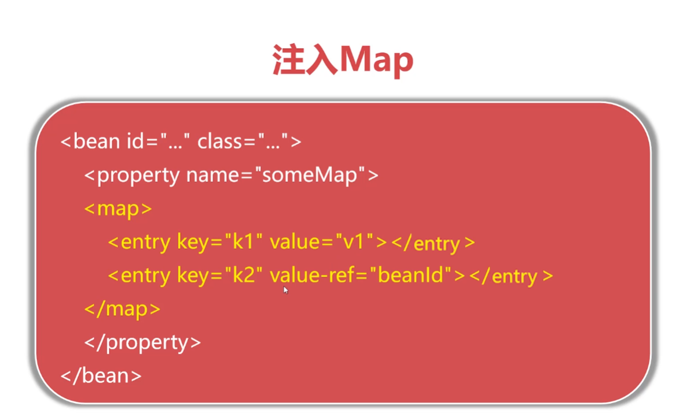 


### 注入-Properties

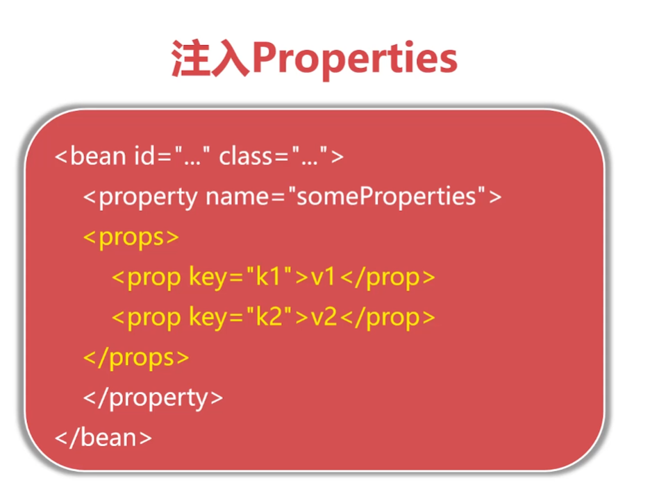 

### bean scope 范围

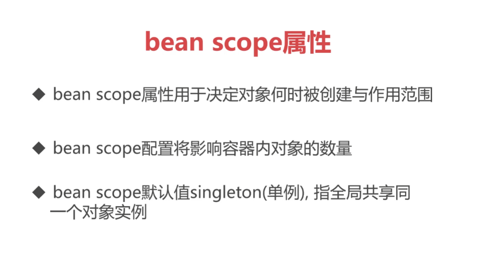 

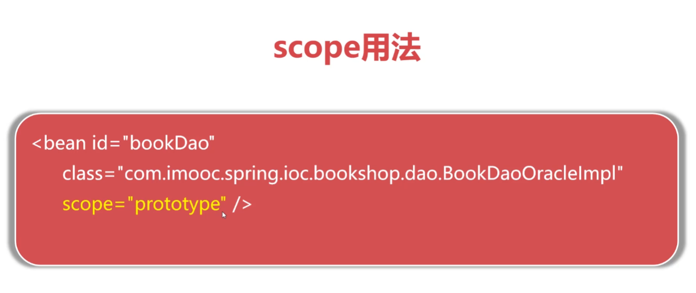


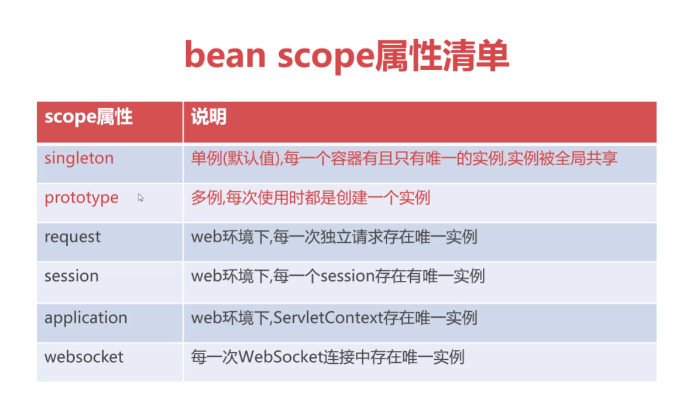

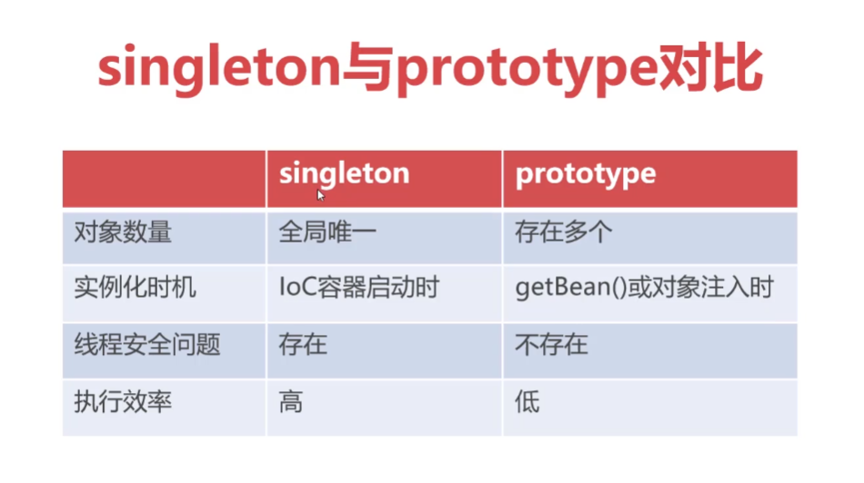 


## 注解

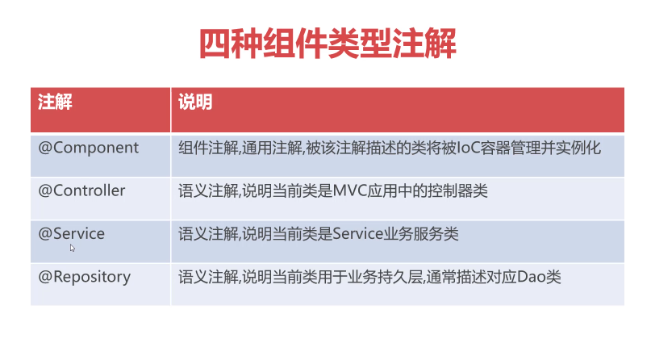

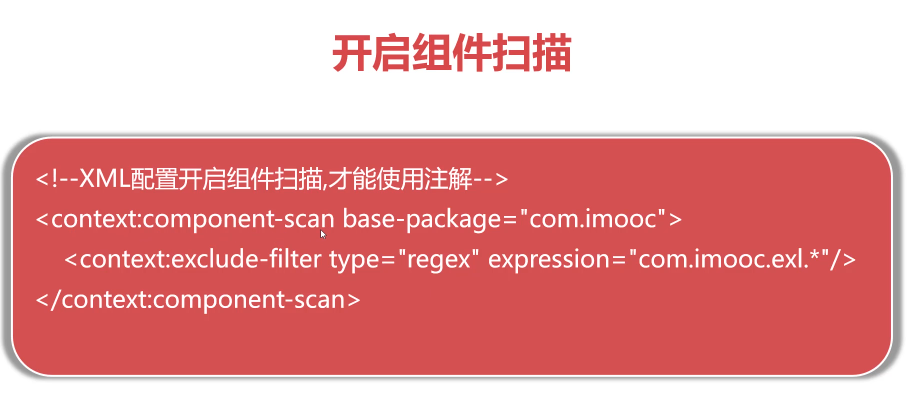

## 自动装配注解

实例化类的时候自动添加初始化赋值：bookDao（名称装配）

```xml
<bean id="bookService" class="com.orangbus.shop.service.BookService">
        <property name="bookDao" ref="bookDao" />
    </bean>
```

`userService`  依赖`userDao` 

```java
@Repository()
public class UserDao {
    public UserDao(){
        System.out.println("正在创建UserDao:"+this);
    }

}
```

```java
@Service
public class UserService {
    @Autowired
    private UserDao userDao;

    public UserService() {
    }

    public UserService(UserDao userDao) {
        this.userDao = userDao;
    }

    public UserDao getUserDao() {
        return userDao;
    }

    public void setUserDao(UserDao userDao) {
        System.out.println("userService 依赖 userDao,我是被依赖注入的");
        System.out.println("userDao == "+userDao);
        this.userDao = userDao;
    }
}
```

测试

```java
public class SpringApplication {
    public static void main(String[] args) {
        ApplicationContext context = new ClassPathXmlApplicationContext("classpath:applicationContext.xml");
        // 获取所有有效的 bean id数组
        String[] ids = context.getBeanDefinitionNames();
        for (String id: ids){
            System.out.println(id+"==="+context.getBean(id));
        }

    }
}
```

注意点

在属性和方法上添加了注解，都能执行set方法

- 如何 `装配注解` 放在方法上，则足鼎按类型对set方法进行注解
- 如果是在属性名添加注解，不会对set进行设置

不推荐按照类型就行装配，推荐使用`@Resource` 


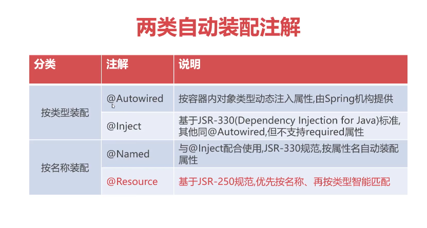

 

## 元数据注解

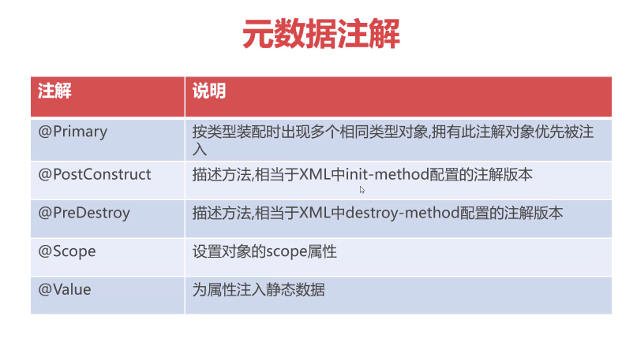 

### @Value

获取配置变量值

举例：数据库链接

1、创建配置文件：config.properties

```java
metaData=orangbus.cn
mysql.drive=mysql
```

2、加载配置文件

```xml
<!--  context.xml  加载配置文件，可以在@Value 中引用-->
<context:property-placeholder location="config.properties"/>
```

3、引用

```java
 @Value("${metaData}") //给这个变量进行赋值
private String metaData;
```

## Java Config

摆脱xml配置

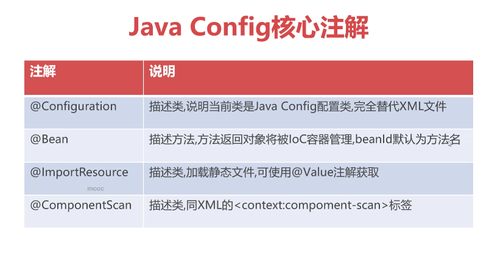 


```java
//  <context:component-scan base-package="com.orangbus" />
@ComponentScan(basePackages = "com.orangbus") 
```

### spring-test

依赖：`spring-test` 

利用 `@RunWith` `@ContextConfiguration` 描述测试用例类

## aop切面编程

类似google的插件

pod.xml

```xml
<dependencies>
        <dependency>
            <groupId>org.aspectj</groupId>
            <artifactId>aspectjweaver</artifactId>
            <version>1.9.7</version>
        </dependency>
    </dependencies>
```

```xml
<?xml version = "1.0" encoding = "UTF-8"?>
<beans xmlns = "http://www.springframework.org/schema/beans"
       xmlns:xsi = "http://www.w3.org/2001/XMLSchema-instance"
       xmlns:aop = "http://www.springframework.org/schema/aop"
       xsi:schemaLocation = "http://www.springframework.org/schema/beans
   http://www.springframework.org/schema/beans/spring-beans-3.0.xsd 
   http://www.springframework.org/schema/aop 
   http://www.springframework.org/schema/aop/spring-aop-3.0.xsd ">

    <!-- bean definition & AOP specific configuration -->

</beans>
```


## JDBC与事务管理

mysql连接

```xml
<?xml version="1.0" encoding="UTF-8"?>
<beans xmlns="http://www.springframework.org/schema/beans"
       xmlns:xsi="http://www.w3.org/2001/XMLSchema-instance"
       xmlns:context="http://www.springframework.org/schema/context"
       xsi:schemaLocation="http://www.springframework.org/schema/beans http://www.springframework.org/schema/beans/spring-beans.xsd">

    <bean id="dataSource" class="org.springframework.jdbc.datasource.DriverManagerDataSource">
        <property name="driverClassName" value="com.mysql.cj.jdbc.Driver" />
        <property name="url" value="jdbc:mysql://localhost:3306/spring_jdbc?useUnicode=true&amp;characterEncode=UTF-8" />
        <property name="username" value="root" />
        <property name="password" value="root" />
    </bean>
    <bean id="jdbcTemplate" class="org.springframework.jdbc.core.JdbcTemplate">
        <!--dataSource写死的-->
        <property name="dataSource" ref="dataSource" />
    </bean>
</beans>
```


### jdbc配置


# idea插件

maven helper

free mybatis plus

Lombok
EasyCode
GsonFormat
Codota
Alibaba Java Coding Guidelines
SonarLine
Translation
Jrebel
CodeGlance
Key Promoter X
MyBatis Log Plugin
Greg Console
Maven Search
Xcode Drak theme
Rainbow Branckets
Active power mode


# 问题解答

## 在mapper.xml映射文件中添加中文注释报错

```xml
<?xml version="1.0" encoding="UTF-8"?>
改为
<?xml version="1.0" encoding="UTF8"?>
```

参考：https://www.cnblogs.com/wutiwang/p/14266256.html

## 数据库连接信息：

```
jdbcUrl
```


