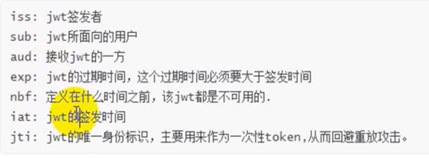

# Oauth2.0

## 流程


## 模式

- 授权码模式（authorization code）
- 简化模式（implicit）
- 密码模式（resource owner password credentials）
- 客户端模式（client credentials）

Oauth2授权主要由两部分组成：

- Authorization server：认证服务
- Resource server：资源服务


## 引入Security依赖

```xml
<?xml version="1.0" encoding="UTF-8"?>
<project xmlns="http://maven.apache.org/POM/4.0.0"
         xmlns:xsi="http://www.w3.org/2001/XMLSchema-instance"
         xsi:schemaLocation="http://maven.apache.org/POM/4.0.0 http://maven.apache.org/xsd/maven-4.0.0.xsd">
    <parent>
        <artifactId>SpringBoot-Study</artifactId>
        <groupId>com.orangbus</groupId>
        <version>0.0.1-SNAPSHOT</version>
    </parent>
    <modelVersion>4.0.0</modelVersion>

    <artifactId>jwt-server</artifactId>

    <properties>
        <maven.compiler.source>11</maven.compiler.source>
        <maven.compiler.target>11</maven.compiler.target>
<!--        引入spring-cloud 版本-->
        <pring-cloud>Greenwich.SR2</pring-cloud>
    </properties>

    <dependencies>
        <!--spring cloud oauth2-->
        <dependency>
            <groupId>org.springframework.cloud</groupId>
            <artifactId>spring-cloud-starter-oauth2</artifactId>
        </dependency>
        <!--spring cloud security-->
        <dependency>
            <groupId>org.springframework.cloud</groupId>
            <artifactId>spring-cloud-starter-security</artifactId>
        </dependency>

        <!--JWT-->
        <dependency>
            <groupId>io.jsonwebtoken</groupId>
            <artifactId>jjwt</artifactId>
            <version>0.9.1</version>
        </dependency>
    </dependencies>

    <!--spring cloud-->
    <dependencyManagement>
        <dependencies>
            <dependency>
                <groupId>org.springframework.cloud</groupId>
                <artifactId>spring-cloud-dependencies</artifactId>
                <version>Greenwich.SR2</version>
                <type>pom</type>
                <scope>import</scope>
            </dependency>
        </dependencies>
    </dependencyManagement>
</project>
```

## 1、自定义密码解析器

```java
```

## 2、实现登录授权两个方法

```java
```


## 授权服务器


## 资源服务器


1、获取授权

```
ip/oauth/authorize?response_type=code&client_id=admin&redirect_url=https://baidu.com&scope=all
```

点击授权，得到==授权码==, 通过==授权码== 拿到acces_token


登录成功或者失败的页面需要是一个post请求

# 授权码模式

1. 需要提供appid和app密码

2. 配置回调地址

3. 验证token接口

```xml

```


# Token

## 依赖

```xml
<dependency>
    <groupId>io.jsonwebtoken</groupId>
    <artifactId>jjwt</artifactId>
    <version>0.9.1</version>
</dependency>
```

## 生成Token

```java
package com.orangbus.jwt.util;

import com.orangbus.jwt.empty.User;
import io.jsonwebtoken.Claims;
import io.jsonwebtoken.JwtBuilder;
import io.jsonwebtoken.Jwts;
import io.jsonwebtoken.SignatureAlgorithm;
import org.springframework.stereotype.Component;

import java.security.Key;
import java.util.Date;

/**
 * jwt
 */
@Component
public class JwtUtil {

    // 加盐
    private final String SALT="orangbus";
    // token 标识符
    private final String TOKEN_NAME="user";

    /**
     * 生成令牌
     */
    public String token(User user){
        // 去除密码
        if (user.getPassword() != null){
            user.setPassword(null);
        }
        // 有效时间
        long now =System.currentTimeMillis();
        Date expTime = new Date(now + 30*30*1000);
        JwtBuilder jwtBuilder = Jwts.builder();
        String token = jwtBuilder.setId("1024")
                // 签发者
                .setIssuer("orangbus")
                // 面向用户
                .setSubject("orangbus.cn")
                // 接受jwt一方
                .setAudience("orangbus")
                // 过期时间
                .setExpiration(expTime)
                // 签发时间
                .setIssuedAt(new Date())
                // 身份标识
                .signWith(SignatureAlgorithm.HS256, SALT)
                // 用户数据
                .claim(TOKEN_NAME,user)
                .compact();
        return token;

    }

    /**
     * 检验是否过期
     */
    public Boolean checkTokenExp(String token){
        Claims claims = Jwts.parser()
                .setSigningKey(SALT)
                .parseClaimsJws(token)
                .getBody();
        long now = System.currentTimeMillis();
        // 获取失效时间
        long expirationDate = claims.getExpiration().getTime();
        if (expirationDate < now){
            return true;
        }else{
            return false;
        }
    }

    /**
     * 用户token换取用户信息
     */
    public Object getUserInfoByToken(String token){
        Claims claims = Jwts.parser()
                .setSigningKey("orangbus")
                .parseClaimsJws(token)
                .getBody();
        Object user = claims.get(TOKEN_NAME);
        return user;
    }
}

```

| iss  |                     |
| ---- | ------------------- |
| iss  | jwt签发者，谁创建的 |
| sub  | jwt面像的用户       |
| aud  |                     |
| exp  |                     |
| nbf  |                     |
| iat  |                     |
| jti  |                     |

 

# Jwt

## JWT组成的部分

### 1、Header(头）

记录令牌类型、签名算法等 例如：{“alg":"HS256","type","JWT}

### 2、Payload（有效载荷）

携带一些用户信息 例如{"userId":"1","username":"mayikt"} 

### 3、Signature(签名）

防止Token被篡改、确保安全性 例如 计算出来的签名，一个字符串              

```xml
<dependency>
    <groupId>io.jsonwebtoken</groupId>
    <artifactId>jjwt</artifactId>
    <version>0.6.0</version>
</dependency>
```

```java
import com.alibaba.fastjson.JSONObject;
import org.apache.commons.codec.digest.DigestUtils;
import org.apache.commons.codec.digest.Md5Crypt;

import java.io.UnsupportedEncodingException;
import java.util.Base64;

public class JWTDemo04 {

    public static void main(String[] args) throws UnsupportedEncodingException {
        String jwtSecret="mayikt";
        // jwt jwtHeader
        JSONObject jwtHeader = new JSONObject();
        jwtHeader.put("alg","HS256");
        jwtHeader.put("typ","jwt");
        // jwt playload 
        JSONObject jwtPlayload = new JSONObject();
        jwtPlayload.put("userName","yushengjun644");
        jwtPlayload.put("age",22);
        //base64JwtHeader
        String base64JwtHeader= Base64.getEncoder().encodeToString(jwtHeader.toJSONString().getBytes());
        String base64JwtPlayload= Base64.getEncoder().encodeToString(jwtPlayload.toJSONString().getBytes());
        // 使用MD5 生成签名
        String signature = DigestUtils.md5Hex(jwtPlayload.toJSONString() + jwtSecret);
        String jwt=base64JwtHeader+"."+base64JwtPlayload+"."+signature;
        System.out.println(jwt);
        // 解密
        String jwtPlayloadStr=new String(Base64.getDecoder().decode(jwt.split("\\.")[1].getBytes()),
                "UTF-8");
        String jwtsignatureStr=jwt.split("\\.")[2];
        System.out.println(DigestUtils.md5Hex(jwtPlayloadStr+jwtSecret).equals(jwtsignatureStr));
      

    }
}
```

# 

# 表单认证

