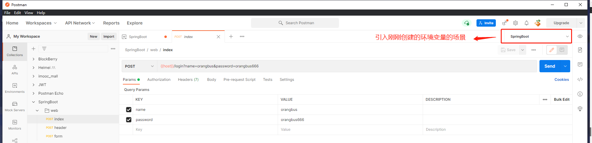

# postman

## 环境变量

可以帮助我们统一修改相同的参数，比如 `请求地址`、`token` 之类的

 

## 如何使用

使用`{{ value_name|key }}` 环境变量中的`key` 自动解析为我们环境变量中的值,当前你要选择你创建的`环境变量的场景` 

```
{{host}}/login 
{{api_url}}/list 
------
localhost:8091/login
localhost:8091/api/list
```

 