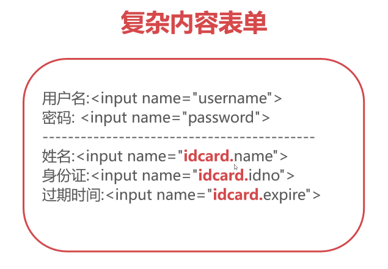
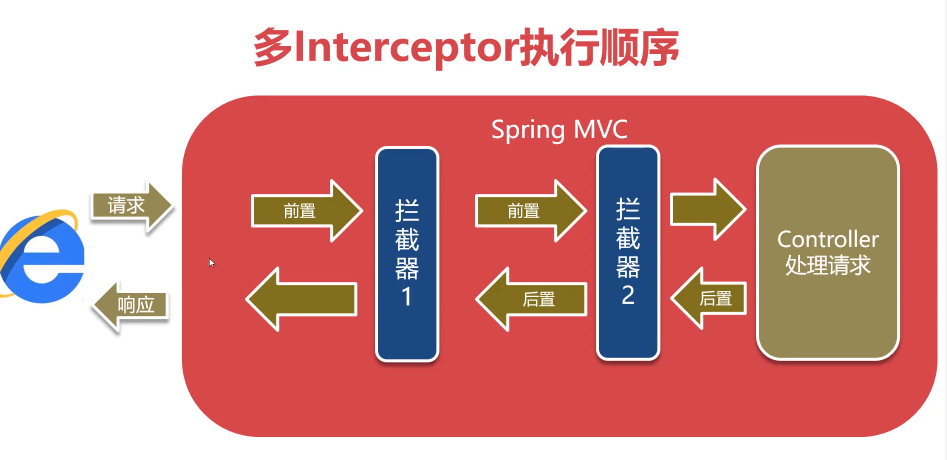

# 安装java

> 下载地址：https://www.oracle.com/java/technologies/javase-downloads.html

下载之前你得先注册一个账号

找到 `Java SE 8` 下载对应的版本

将下载的文件解压到 `/usr/local/java` （这个位置你可以随便放）

配置java环境变量

```
vim ~/.bashrc
=====
export JAVA_HOME=/usr/local/java
export CLASSPATH=.:$JAVA_HOME/jre/lib/rt.jar:$JAVA_HOME/lib/dt.jar:$JAVA_HOME/lib/tools.jar
export PATH=$PATH:$JAVA_HOME/bin
```

重载配置

```
source ~/.bashrc
```

验证

```bash
java -version
```

# tomcat本地安装

不要使用新版本

> https://tomcat.apache.org/download-10.cgi#10.0.10

1、下载 `core` ，解压

2、启动，进入解压的`tomcat` 文件夹

- 授权

  ```bash
  cd path/to/tomcat
  
  cd bin
  
  # 授权
  sudo chmod a+x startup.sh catalina.sh catalina.sh
  ```

- 启动

  ```bash
  ./startup.sh # 
  # or
  ./catalina.sh run # 控制台打印的方式
  ```

- 关闭

  ```bash
  ./shutdown.sh
  ```

3、浏览器输入：`localhost:8080`验证是否启动成功

# docker方式安装tomcat


# 配置

pom.xml

```xml
<repositories>
        <repository>
            <id>aliyun</id>
            <name>aliyun</name>
            <url>https://maven.aliyun.com/repository/public</url>
        </repository>
    </repositories>

    <dependencies>
        <dependency>
            <groupId>org.springframework</groupId>
            <artifactId>spring-webmvc</artifactId>
            <version>5.2.16.RELEASE</version>
        </dependency>
    </dependencies>
```

# 2、配置web.xml

```xml
<?xml version="1.0" encoding="UTF-8"?>
<web-app xmlns="http://xmlns.jcp.org/xml/ns/javaee"
         xmlns:xsi="http://www.w3.org/2001/XMLSchema-instance"
         xsi:schemaLocation="http://xmlns.jcp.org/xml/ns/javaee http://xmlns.jcp.org/xml/ns/javaee/web-app_4_0.xsd"
         version="4.0">

    <servlet>
        <servlet-name>springmvc</servlet-name>
        <servlet-class>org.springframework.web.servlet.DispatcherServlet</servlet-class>
        <load-on-startup>0</load-on-startup>
        <init-param>
            <param-name>contextConfigLocation</param-name>
            <param-value>classpath:applicationContext.xml</param-value>
        </init-param>
    </servlet>
    <servlet-mapping>
        <servlet-name>springmvc</servlet-name>
        <url-pattern>/</url-pattern>
    </servlet-mapping>
</web-app>
```

添加 `applicationContext.xml`

```xml-dtd
<?xml version="1.0" encoding="UTF-8"?>
<beans xmlns="http://www.springframework.org/schema/beans"
       xmlns:xsi="http://www.w3.org/2001/XMLSchema-instance"
       xmlns:p="http://www.springframework.org/schema/p"
       xmlns:context="http://www.springframework.org/schema/context"
       xmlns:mvc="http://www.springframework.org/schema/mvc"
       xmlns:task="http://www.springframework.org/schema/task"
       xsi:schemaLocation="
                 http://www.springframework.org/schema/beans
                 http://www.springframework.org/schema/beans/spring-beans-4.2.xsd
                 http://www.springframework.org/schema/context
                 http://www.springframework.org/schema/context/spring-context-4.2.xsd
                http://www.springframework.org/schema/mvc
                 http://www.springframework.org/schema/mvc/spring-mvc-4.2.xsd
                 http://www.springframework.org/schema/task
                http://www.springframework.org/schema/task/spring-task-4.2.xsd">

    <!--
    扫描包
    拥有一下对象
    @Repository
    @Service
    @Controller
    @Component
    -->
    <context:component-scan base-package="com.orangbus.springmvc" />
<!--   启动spring mvc 的注解开发模式 -->
    <mvc:annotation-driven/>
<!--   排除静态资源 -->
    <mvc:default-servlet-handler/>

    
    
</beans>


```

# 请求

## 复杂表单赋值



通过表单新增加一个属性的方式添加，同时实例化对象的实体类

## 时间转化

controller

```
1996-10-24

@GetMapping("/date")
@ResponseBody
public String todate(@DateTimeFormat(pattern="yyyy-MM-dd") Date create_time){
System.out.println(create_time);
return "success";
}
```

emtity

```
@DateTimeFormat(pattern='yyyy-MM-dd')
pricate Date create_time;
```

全局时间转化,新建一个类

```java
package com.orangbus.springmvc.converter;


import org.springframework.core.convert.converter.Converter;

import java.text.ParseException;
import java.text.SimpleDateFormat;
import java.util.Date;

public class DateConserter implements Converter<String,Date> {
    @Override
    public Date convert(String s) {
        SimpleDateFormat sdf = new SimpleDateFormat("yyyy-MM-dd");
        try {
            Date date = sdf.parse(s);
            return date;
        } catch (ParseException e) {
//            e.printStackTrace();
            return null;
        }
    }
}

```

```xml
 <!--   启动spring mvc 的注解开发模式 -->
    <mvc:annotation-driven conversion-service="converionService"/>
<!--    时间转换类-->
    <bean id="converionService" class="org.springframework.format.support.FormattingConversionServiceFactoryBean" >
        <property name="converters" >
            <set>
                <bean class="com.orangbus.springmvc.converter.DateConserter"/>
            </set>
        </property>
    </bean>
```


## 中文乱码

get请求： 修改tomcat`server.xml` 增加 `URLEncoding` 属性

```xml
<Connector port="8080" protocol="HTTP/1.1"
               connectionTimeout="20000"
               URIEncoding="UTF-8"
               redirectPort="8443"  />
```

Post请求：webApp `web.xml` 配置 `CharacterEncodingFilter` 

```xml
<filter>
    <filter-name>character</filter-name>
    <filter-class>org.springframework.web.filter.CharacterEncodingFilter</filter-class>
    <init-param>
        <param-name>encoding</param-name>
        <param-value>UTF-8</param-value>
    </init-param>
</filter>

<filter-mapping>
    <filter-name>character</filter-name>
    <url-pattern>/*</url-pattern>
</filter-mapping>
```


Response响应： `applicationContext.xml`配置 `StringHttpMessageConverter` 

```xml
 <mvc:annotation-driven conversion-service="converionService">
        <mvc:message-converters>
            <bean class="org.springframework.http.converter.StringHttpMessageConverter">
                <property name="supportedMediaTypes">
                    <list>
                        <value>text/html;charset=utf-8</value>
                    </list>
                </property>
            </bean>
        </mvc:message-converters>
    </mvc:annotation-driven>
```

## 响应 ModelAndView

```java
 @GetMapping("/view")
    public ModelAndView view(){
        ModelAndView view = new ModelAndView("view.jsp");
        com.orangbus.springmvc.emtity.User user = new com.orangbus.springmvc.emtity.User();
        user.setName("orangbus");
        view.addObject("user",user);
        return view;
    }
```

## freemarker模板引擎

pom.xml

```xml
```

## json序列化

pom.xml

```xml
<dependency>
    <groupId>com.fasterxml.jackson.core</groupId>
    <artifactId>jackson-core</artifactId>
    <version>2.12.5</version>
</dependency>
<dependency>
    <groupId>com.fasterxml.jackson.core</groupId>
    <artifactId>jackson-databind</artifactId>
    <version>2.12.4</version>
</dependency>
<dependency>
    <groupId>com.fasterxml.jackson.core</groupId>
    <artifactId>jackson-annotations</artifactId>
    <version>2.12.4</version>
</dependency>
```

返回数据会自动序列化

# 时间输出

```java
 @JsonFormat(pattern = "yyyy-MM-dd HH:mm:ss",timezone = "GMT+8")
private Date create_time;
```

# 跨域处理

controller类上添加注解

```java
@CrossOrigin（origins={'http://orangbus.cn'}）
@CrossOrigin（origins={'*'}）
```

全局配置

applicationContext.xml

```xml
<!--跨域访问配置-->
<mvc:cors>
    <mvc:mapping path="/restful/**" allowed-origins="http://localhost,http://orangbus.com"/>
</mvc:cors>
```

# 拦截器 - interceptor

- 拦截器也会拦截静态资源

- 多个拦截器处理流程

  


对请求进行前置后后置的过滤

1、依赖

```xml
<dependency>
  <groupId>javax.servlet</groupId>
  <artifactId>servlet-api</artifactId>
  <version>2.5</version>
</dependency>
```


2、实现 `HandlerInterceptor` 接口


```java
package com.orangbus.springmvc.interceptor;

import org.springframework.web.servlet.HandlerInterceptor;
import org.springframework.web.servlet.ModelAndView;

import javax.servlet.http.HttpServletRequest;
import javax.servlet.http.HttpServletResponse;

public class MyInterceptor implements HandlerInterceptor {

    /**
     * 前置处理，还没有到controller
     * @param request
     * @param response
     * @param handler
     * @return
     * @throws Exception
     */
    @Override
    public boolean preHandle(HttpServletRequest request, HttpServletResponse response, Object handler) throws Exception {
        System.out.println(request.getRequestURI()+"准备执行");
        return HandlerInterceptor.super.preHandle(request, response, handler);
    }

    /**
     * 资源已被处理
     * @param request
     * @param response
     * @param handler
     * @param modelAndView
     * @throws Exception
     */
    @Override
    public void postHandle(HttpServletRequest request, HttpServletResponse response, Object handler, ModelAndView modelAndView) throws Exception {
        System.out.println(request.getRequestURI() + "还没有产生响应之前执行");
        HandlerInterceptor.super.postHandle(request, response, handler, modelAndView);
    }

    /**
     * 产生响应
     * @param request
     * @param response
     * @param handler
     * @param ex
     * @throws Exception
     */
    @Override
    public void afterCompletion(HttpServletRequest request, HttpServletResponse response, Object handler, Exception ex) throws Exception {
        System.out.println(request.getRequestURI() + "产生响应之后执行");
        HandlerInterceptor.super.afterCompletion(request, response, handler, ex);
    }
}

```


3、配置过滤地址

```xml
<mvc:interceptors>
    <mvc:interceptor>
<!--        拦截规则-->
        <mvc:mapping path="/**" />
<!--        排除不需要拦截的内容-->
        <mvc:exclude-mapping path="/**.css"/>
        <mvc:exclude-mapping path="/**.js"/>
<!--        加载拦截器-->
        <bean class="com.orangbus.springmvc.interceptor.MyInterceptor" />
    </mvc:interceptor>
</mvc:interceptors>
```

案例一:请求日志记录

```xml
 <dependency>
     <groupId>ch.qos.logback</groupId>
     <artifactId>logback-classic</artifactId>
     <version>1.2.5</version>
</dependency>
```


