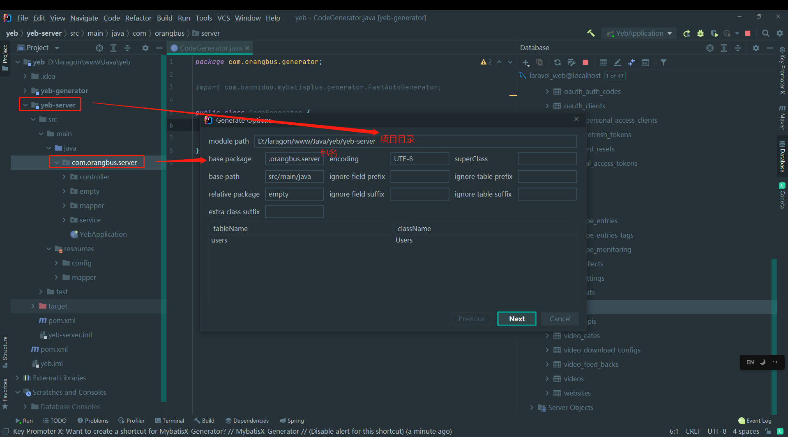
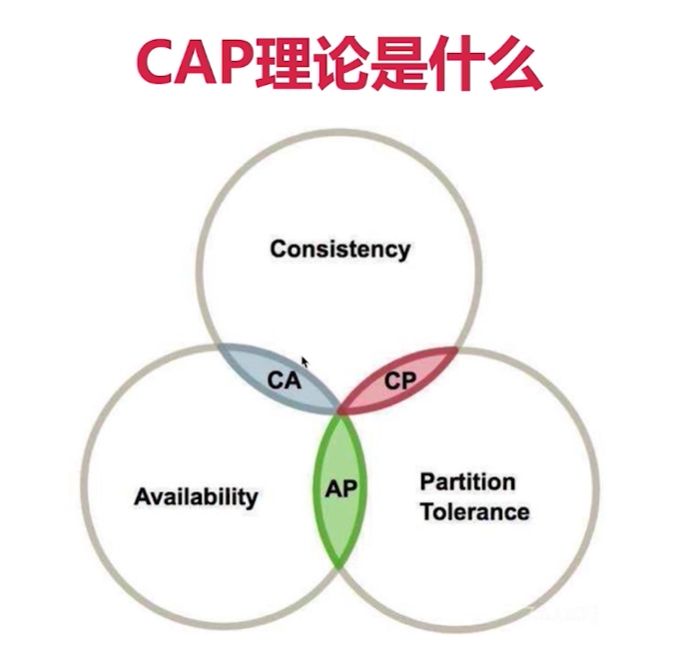
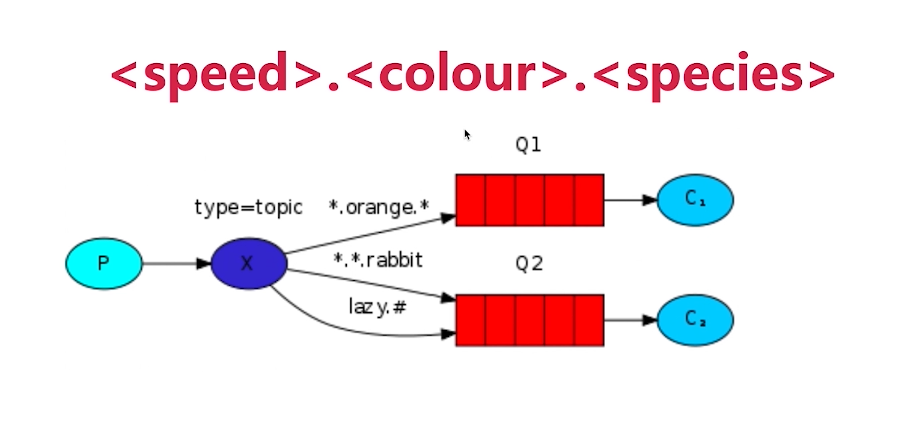
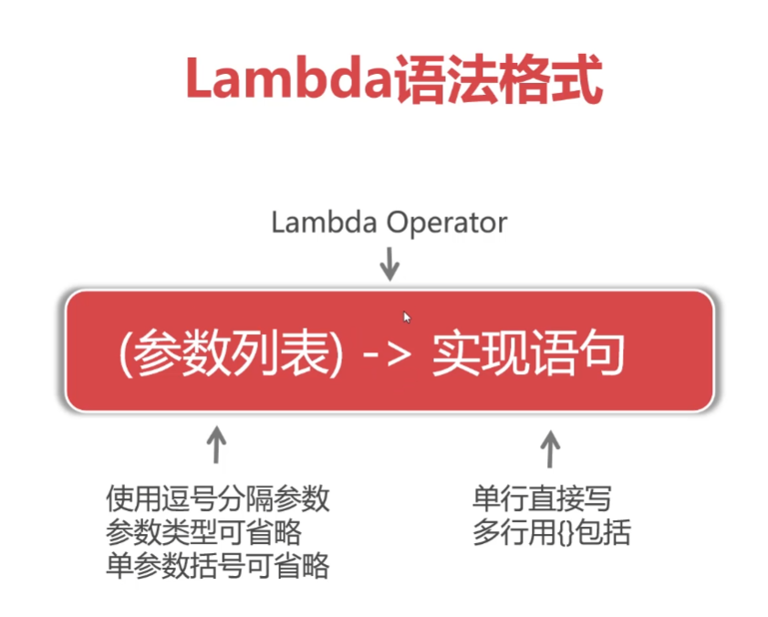

# 初始化项目

## 父工程

```xml
<?xml version="1.0" encoding="UTF-8"?>
<project xmlns="http://maven.apache.org/POM/4.0.0" xmlns:xsi="http://www.w3.org/2001/XMLSchema-instance"
         xsi:schemaLocation="http://maven.apache.org/POM/4.0.0 https://maven.apache.org/xsd/maven-4.0.0.xsd">
    <modelVersion>4.0.0</modelVersion>
    
    <parent>
        <groupId>org.springframework.boot</groupId>
        <artifactId>spring-boot-starter-parent</artifactId>
        <version>2.6.3</version>
        <relativePath/> <!-- lookup parent from repository -->
    </parent>
    
    <groupId>com.orangbus</groupId>
    <artifactId>yeb</artifactId>
    <version>0.0.1-SNAPSHOT</version>
	<!--pom管理-->
    <packaging>pom</packaging>
    <name>yeb</name>
    <description>yeb</description>
    <properties>
        <java.version>11</java.version>
    </properties>

</project>

```

## 依赖

```xml
<!-- web 依赖-->
<dependency>
    <groupId>org.springframework.boot</groupId>
    <artifactId>spring-boot-starter-web</artifactId>
</dependency>

<!-- lombok 依赖-->
<dependency>
    <groupId>org.projectlombok</groupId>
    <artifactId>lombok</artifactId>
</dependency>

<!-- mysql 依赖-->
<dependency>
    <groupId>mysql</groupId>
    <artifactId>mysql-connector-java</artifactId>
    <scope>runtime</scope>
</dependency>

<!-- mybatis-plus 依赖-->
<dependency>
    <groupId>com.baomidou</groupId>
    <artifactId>mybatis-plus-boot-starter</artifactId>
    <version>3.3.1.tmp</version>
</dependency>

 <!-- mybatis-plus 代码生成器-->
<dependency>
    <groupId>com.baomidou</groupId>
    <artifactId>mybatis-plus-generator</artifactId>
    <version>3.5.1</version>
</dependency>

<!-- freemarker 模板引擎-->
<dependency>
    <groupId>org.freemarker</groupId>
    <artifactId>freemarker</artifactId>
</dependency>

<!-- swagger2 依赖-->
<dependency>
    <groupId>io.springfox</groupId>
    <artifactId>springfox-swagger2</artifactId>
    <version>3.0.0</version>
</dependency>
<dependency>
    <groupId>com.github.xiaoymin</groupId>
    <artifactId>swagger-bootstrap-ui</artifactId>
    <version>1.9.6</version>
</dependency>

 <!--security 依赖-->
<dependency>
    <groupId>org.springframework.boot</groupId>
    <artifactId>spring-boot-starter-security</artifactId>
</dependency>
<!--jwt 依赖-->
<dependency>
    <groupId>io.jsonwebtoken</groupId>
    <artifactId>jjwt</artifactId>
    <version>0.9.1</version>
</dependency>
```


## 配置文件

application.yml

```yaml
server:
  port: 8081

spring:
  profiles: # 使用那个环境的配置
    active: dev
```

application-dev.yml

```yaml
server:
  port: 8081

# 开启热部署
spring:
  thymeleaf:
    cache: false
  devtools:
    livereload:
      enabled: true #是否支持livereload
      port: 35729
    restart:
      enabled: true

  # 本地数据库连接
  datasource:
    username: root
    password: root
    url: jdbc:mysql://127.0.0.1:3306/laravel_web?useSSL=false&useUnicode=true&characterEncode=UTF-8&serverTimezone=GMT
    driver-class-name: com.mysql.cj.jdbc.Driver

  logging:
    level:
      root: info
      org.orangbus: debug
      #com.baomidou: debug
    file:
      path: /log/logs.txt

#mybatis-plus 配置
mybatis-plus:
  mapper-locations: classpath*:/mapper/*Mapper.xml
  # 配置 数据返回类型的别名
  type-aliases-package: com.orangbus.server.pojo
  configuration:
    # 自动驼峰命名
    map-underscore-to-camel-case: false

# mybatis sql 打印 （方法接口所在的包，不是mapper.xml所在的包）
logging:
  level: 
    com.orangbus.server.mappder: debug
```

application-prod.yml

```yaml
spring:
	thymeleaf:
		mode: HTML
	profiles: //具体使用那个配置文件
		active: dev
```

## 逆向工程-生成Empty

官网：[https://baomidou.com/guide/install.html#release](https://baomidou.com/guide/install.html#release) 

代码生成插件：mybatisx | MyBatis Generator | Free MyBatis plugin

 


## Swagger-ui配置

```java
```


# 注解

```java
// 拦截标注为 @Controller 的类
@ControllerAdvi


```

实体类注解

```java
@Entity

@Table(name='table_name')

@id

// 生成策略
@GeneratedValue

// 时间转化
@Temporal(TemporalType,TIMESTAMP
```


# 自定义跳转连接

```java
 String user = null;
if (user == null){
    throw new NotFondException("用户不能为空！");
}
```

```java
```

# Aop记录日志

```java
th:replace='app::header(~{::title})'
th:href="@{/css/app.css}"
    
// 重定向跳转
return "redirect:/admin" 
```


# 统一数据返回

```java
package com.orangbus.common.common;

import lombok.Data;

@Data
public class ApiResponse<T> {
    private Integer status;
    private String message;
    private T data;

    // 默认成功返回
    private static final int SUCCESS_CODE=200;
    private static final String SUCCESS_MESSAGE="success";
    // 默认失败返回
    private static final int ERROR_CODE=202;
    private static final String ERROR_MESSAGE="error";

    /**
     * 构造函数
     * @param status
     * @param message
     * @param data
     */
    public ApiResponse(Integer status, String message, T data) {
        this.status = status;
        this.message = message;
        this.data = data;
    }

    /**
     * 两参函数
     * @param status
     * @param message
     */
    public ApiResponse(Integer status, String message) {
        this.status = status;
        this.message = message;
    }

    public ApiResponse(){
        this(SUCCESS_CODE,SUCCESS_MESSAGE);
    }

    /**
     * 成功返回
     */
    public static <T> ApiResponse<T> success(){
        return  new ApiResponse<>();
    }

    public static <T> ApiResponse<T> success(String message){
        ApiResponse<T> response = new ApiResponse<>();
        response.setMessage(message);
        return response;
    }

    public static <T> ApiResponse<T> success(String message,Integer code){
        ApiResponse<T> response = new ApiResponse<>();
        response.setMessage(message);
        response.setStatus(code);
        return response;
    }

    public static <T> ApiResponse<T> success(T result){
        ApiResponse<T> response = new ApiResponse<>();
        response.setData(result);
        return response;
    }

    /**
     * 失败返回
     */
    public static <T> ApiResponse<T> error(){
        ApiResponse<T> response = new ApiResponse<>();
        response.setStatus(ERROR_CODE);
        response.setMessage(ERROR_MESSAGE);
        return response;
    }

    public static <T> ApiResponse<T> error(String message){
        ApiResponse<T> response = new ApiResponse<>();
        response.setStatus(ERROR_CODE);
        response.setMessage(message);
        return response;
    }

    public static <T> ApiResponse<T> error(String message,Integer code){
        ApiResponse<T> response = new ApiResponse<>();
        response.setMessage(message);
        response.setStatus(code);
        return response;
    }
}
```

# 开发开发流程

`controller`  调用 `service` 层 ，`service` 层定义接口，`impl` 实现`serice接口`去处理实际的业务逻辑，最后实现接口层`impl` 与实体类`Mapper` 层（数据库对应的字段）进行交互，对异常进行处理。

Aop: 

Filter: 过滤器，相当于php中的中间件，对请求进行拦截，已经记录相关日志


## 1、controller 

### 注解

### @PathVariable

```java
/**
     * 获取路径变量
     * @param id
     * @param name
     * @return
     */
@GetMapping("/detail/{name}/{id}")
public ApiResponse path(@PathVariable("id") Integer id, @PathVariable("name") String name, @PathVariable Map<String, String> all){
    HashMap<String, Object> map = new HashMap<>();
    map.put("id",id);
    map.put("name",name);
    map.put("all",all);
    return ApiResponse.success(map);
}
```

### @RequestHeader

```java
 /**
     * 请求头相关的处理
     * @param header
     * @return
     */
@GetMapping("/getHeader")
public ApiResponse header(
    @RequestHeader Map<String,String> header,
    @RequestHeader("host") String host
){
    header.put("req-host",host);
    return ApiResponse.success(header);
}
```


### @ModelAttribute

页面跳转携带的参数


### @RequestParam

```java
@PostMapping("/index")
public ApiResponse login(
    @RequestParam String name,
    @RequestParam String password
){
    HashMap<String, String> map = new HashMap<>();
    map.put("name",name);
    map.put("password",password);
    return ApiResponse.success(map);
}
```


### @MatrixVariable


### @CookieValue


### @RequestBody


### 请求参数处理

```java
@PostMapping("/index")
public ApiResponse login(
    @RequestParam String name,
    @RequestParam String password
){
    HashMap<String, String> map = new HashMap<>();
    map.put("name",name);
    map.put("password",password);
    return ApiResponse.success(map);
}
```


请求头

```
```


## 2、 service 

处理业务逻辑：定义接口 -> 实现接口


## 3、model

定义表的映射关系

### dao: 数据库查询方法

### pojo: 实体类-数据库字段


# 模板Thymeleaf

### 1、Thymeleaf母版页示例

- 母版页代码(resources/templates/shared/layout1.html)

```html
<!DOCTYPE html>
<html lang="en">
<head>
    <title th:text="${title}"></title>
</head>
<body>
<div layout:fragment="content">
    默认内容
</div>
</body>
</html>
```

母版页定义一个`id=content`的片段，以便子页面可以替换该内容

### 2、Thymeleaf子页面继承示例

- 子页面代码(resources/templates/demo/page1.html)

```html
<div layout:decorator="shared/layout1">
    <div layout:fragment="content">
        page1子页面内容
    </div>
</div>
```

子页面引入模板layout1.html作为模板，并定义content同名片段覆盖母版页内容

### 3、 控制器代码示例

```html
@RequestMapping("/page1")
ModelAndView page1(){
    ModelAndView modelAndView=new ModelAndView();
    modelAndView.addObject("title","page1页面标题");
    modelAndView.setViewName("demo/page1");
    return modelAndView;
}
```

### 4、最终的渲染结果

```html
<!DOCTYPE html>
<html>
<head>
    <title>page1页面标题</title>
</head>
<body>
    <div>
        page1子页面内容
    </div>
</body>
</html>
```

### Thymeleaf语法/标签说明

| 语法/标签        | 说明                                     |
| ---------------- | ---------------------------------------- |
| layout:fragment  | 定义模板片段，可以在子页面用同名片段覆盖 |
| layout:decorator | 引用Thymeleaf页面作为母版/模板           |

# 拦截器

用于用户是否登录判断


# 配置文件

## application.properties

```properties
server.port=8081
orangbus.name="orangbus"
===== yaml =====
server:
	port: 8081
orangbus:
	name: "orangbus"
```

## application.yml

```yaml
server:
  port: 8080

# 开启热部署
spring:
  profiles: # 使用哪个配置文件 dev|prod
    active: prod
```

```yaml
server:
  port: 8080

# 开启热部署
spring:
  thymeleaf:
    cache: false
  devtools:
    livereload:
      enabled: true #是否支持livereload
      port: 35729
    restart:
      enabled: true

 # 本地数据库连接
  datasource:
    username: root
    password: root
    url: jdbc:mysql://127.0.0.1:3306/java_video?useSSL=false&useUnicode=true&characterEncode=UTF-8&serverTimezone=GMT
    driver-class-name: com.mysql.cj.jdbc.Driver

logging:
  level:
    root: info
    org.orangbus.video: debug
    #com.baomidou: debug
  file:
    path: /log/logs.txt


```


获取变量

```java
@Value("${orangbus.name}")
String name;
```

## config对象

```java
package com.orangbus.video.config;

import org.springframework.beans.factory.annotation.Autowired;
import org.springframework.boot.context.properties.ConfigurationProperties;
import org.springframework.stereotype.Component;

@Component
@ConfigurationProperties(prefix = "orangbus") //前缀
public class Mysql {
    String database;
    String table;

    public String getDatabase() {
        return database;
    }

    public void setDatabase(String database) {
        this.database = database;
    }

    public String getTable() {
        return table;
    }

    public void setTable(String table) {
        this.table = table;
    }
}

```

使用

```java
@Autowired
Mysql mysql;
 mysql.database;
```

# 文件上传

```yaml
spring:
  servlet:
    multipart:
      max-file-size: 10MB
      max-request-size: 100MB
```

```html
<!doctype html>
<html lang="en" xmlns:th="http://www.thymeleaf.org">
<head>
    <meta charset="UTF-8">
    <meta name="viewport"
          content="width=device-width, user-scalable=no, initial-scale=1.0, maximum-scale=1.0, minimum-scale=1.0">
    <meta http-equiv="X-UA-Compatible" content="ie=edge">
    <link href="https://cdn.bootcdn.net/ajax/libs/twitter-bootstrap/5.0.2/css/bootstrap.min.css" rel="stylesheet">
    <title>文件上传</title>
</head>
<body>
<div class="container">
  <div class="row mt-5">
    <div class="col-md-6 offset-md-3">
        <div class="alert alert-success" role="alert" th:if="${msg}" th:text="${msg}">
            <strong>success</strong>
        </div>
        <form action="/upload" method="post" enctype="multipart/form-data">
            <div class="form-group">
                <label for="">文件上传</label>
                <input type="file" class="form-control-file" name="img" id="">
            </div>
            <div class="form-group mt-3">
                <label for="">多文件上传</label>
                <input type="file" class="form-control-file" name="photos" multiple >
            </div>
            <div class="form-group">
                <button type="submit" class="btn btn-primary btn-block mt-2">上传</button>
            </div>
        </form>

    </div>
  </div>
</div>

<link href="https://cdn.bootcdn.net/ajax/libs/twitter-bootstrap/5.0.2/css/bootstrap-utilities.rtl.min.css" rel="stylesheet">
<script src="https://cdn.bootcdn.net/ajax/libs/jquery/3.6.0/jquery.min.js"></script>
</body>
</html>
```

```java
package com.orangbus.web.controller;

import com.orangbus.common.common.ApiResponse;
import lombok.extern.slf4j.Slf4j;
import org.springframework.stereotype.Controller;
import org.springframework.web.bind.annotation.GetMapping;
import org.springframework.web.bind.annotation.PostMapping;
import org.springframework.web.bind.annotation.RequestPart;
import org.springframework.web.multipart.MultipartFile;
import org.springframework.web.servlet.mvc.support.RedirectAttributes;

import java.io.File;
import java.io.IOException;

@Controller
@Slf4j
public class UploadFile {

    @GetMapping("/form")
    public String form() {
        return "upload/index";
    }

    @PostMapping("/upload")
    public String upload(
            @RequestPart("img") MultipartFile img,
            @RequestPart("photos") MultipartFile[] photos,
            RedirectAttributes redirectAttributes
    ) throws IOException {
        log.info("img:{}", img.getOriginalFilename());
        log.info("photos:{}", photos.length);

        // 单文件上传
        if (!img.isEmpty()) {
            // 保存到服务器
            img.transferTo(new File("D:\\logs\\" + img.getOriginalFilename()));
        }

        // 多文件上传
        if (photos.length > 0) {
            for (MultipartFile photo : photos) {
                String originalFilename = photo.getOriginalFilename();
                photo.transferTo(new File("D:\\logs\\" + originalFilename));
            }
        }
        redirectAttributes.addFlashAttribute("msg", "文件上传成");
        return "redirect:/form";
    }
}

```

# 异常处理

自定义相应模板错误页面


自定义相应 json 错误信息


# 数据库访问

```xml
```

## druid数据源

```xml
// 过时了
<dependency>
     <groupId>com.alibaba</groupId>
     <artifactId>druid</artifactId>
     <version>1.1.22</version>
</dependency>

//最新
<dependency>
    <groupId>com.alibaba</groupId>
    <artifactId>druid-spring-boot-starter</artifactId>
    <version>1.2.8</version>
</dependency>
```

配置

```java
spring:
 druid:
      filters: stat,wall
      access-to-underlying-connection-allowed: true
      aop-patterns: true # 监控配置
      stat-view-servlet: # 开启监控页面
        enabled: true
        login-username: admin
        login-password: admin
        reset-enable: false
      web-stat-filter:
        enabled: true
        url-pattern: /* # 监控地址
        exclusions: '' # 排除地址
```


## redis


# 线程池

 

 

## 创建


停止线程

```java
shutdown: 不会新增新的任务
isShutdown：是否终止了线程
isTerminated： 所有的线程都直行完毕
```


## 工作队列类型

1. 直接交接：SynchronousQueue
2. 无界队列：LinkedBlockingQueue
3. 有界队列：ArrayBlockingQueue

## 分布式：分散能力

单一功能

## 集群：分担压力

统一业务，不同机器


## cap定理

Consistency : 一致性：读操作是否能读到前一个写的操作结果

Availability : 可用性 ，非故障节点应该在合理的时间范围内作出响应

Partition tolerance: 分区容存，当出现网络分区现象后，系统能都继续运行（网络通信错误）

 

# RabbitMq

## spring-boot-rabbitmq

```xml
<dependency>
     <groupId>org.springframework.boot</groupId>
     <artifactId>spring-boot-starter-amqp</artifactId>
</dependency>
```


AMQP协议

## 安装


## 交换机

`fanout` 广播：只需要将队列绑定到交换机上即可，是不需要设置路由键的


`direct` 根据`RoutingKey` 匹配消息路由到指定的队列

`topic` 生产者指定`RoutingKey` 消息根据消费端指定的队列通过模糊匹配的方式进行相应转发

 

- `*` 替代一个单词
- `#` 替代0或多个单词

`headers` 根据发送消息内容中的headers属性来匹配


# 微服务

是一种架构风格

springcloud： 众多子项目

[dubbo](https://dubbo.apache.org/zh/docs/quick-start/) ：https://dubbo.apache.org/zh/docs/quick-start/

差分建议（不适合差分）

- 小团队，技术薄弱

- 流量小，压力小，业务变化不大

- 延迟敏感

# Lambda表达式

 

# 部署到服务器


```bash
nohub java-jar -Dserver.port=80 -Dspring.profiles.active=prod /path/to/project.jar > /tmp/null 2>&
```


