> 我一直使用的是[toolbox](https://www.jetbrains.com/zh-cn/toolbox-app/),如果你是单独安装的，请自测，理论应该是一样。
>
> 亮点：
>
> 1、自定义激活时间
>
> 2、付费插件也会一并激活
>
> 目前就发现这两个比较吸引我的地方。

先上号看效果

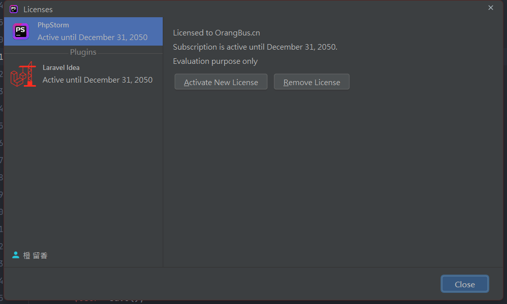 

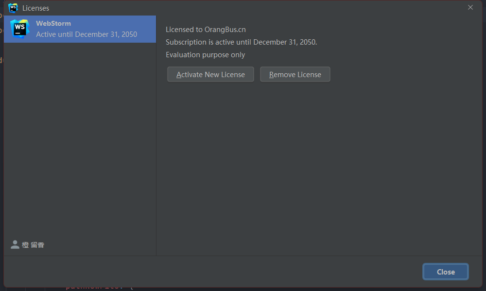 

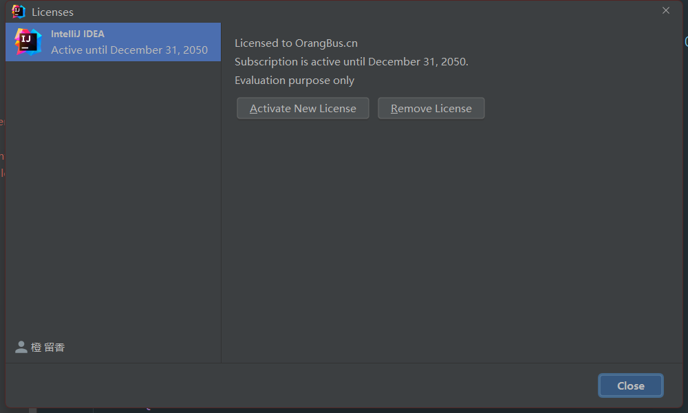 

以下方法是基于window的，mac和linux跟这个步骤类似，你们自己试试吧。

# 下载toolbox

下载地址：https://www.jetbrains.com/zh-cn/toolbox-app/

2021.3.1版本测试OK

**安装你需要的编辑器** 

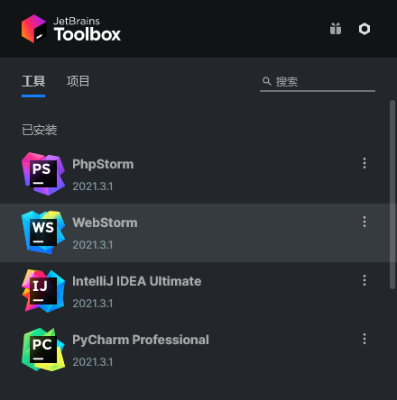

# 下载补丁文件

加入QQ群获取：[【OrangBus】511300462]( https://jq.qq.com/?_wv=1027&k=aLQW6KUo) （请仔细查看【使用必看】）

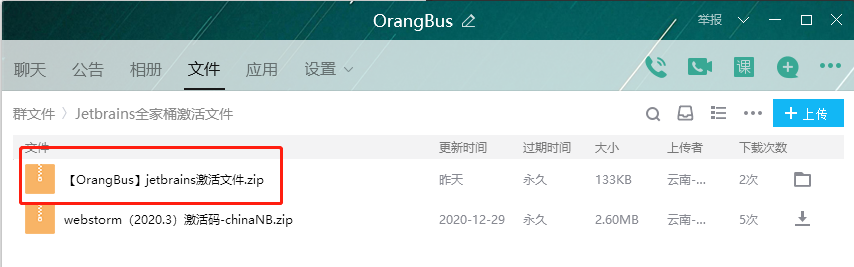 

**1、解压群文件，放到一个你不太动的文件夹里面，并且复制当前路径** 

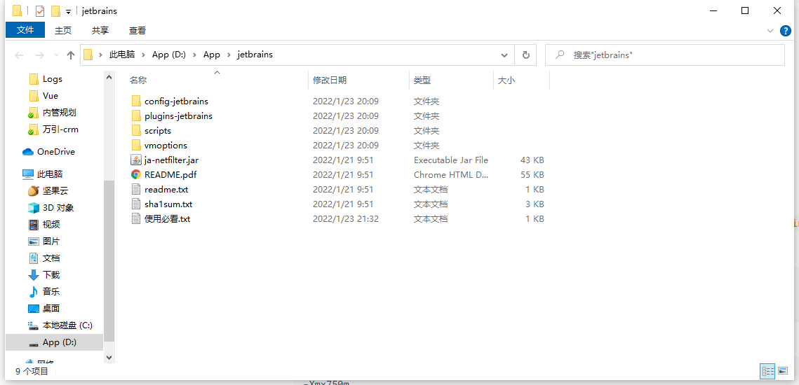 

假如你存放的路径是这样的：`D:\App\jetbrains` 

**2、找到软件安装的位置，添加一行东西** 

用phpstorm举例：`D:\Program Files (x86)\JetBrains\apps\WebStorm\ch-0\213.6461.79\bin`

在文件夹里面找到`phpstorm64.exe.vmoptions` 用记事本打开，加入下面这一行

```text
# -javaagent:第一步得到的路径/ja-netfilter.jar=jetbrains 

-javaagent:D:/App/jetbrains/ja-netfilter.jar=jetbrains 
```

我的完整配置

```
-Xms128m
-Xmx750m
-XX:ReservedCodeCacheSize=512m
-XX:+IgnoreUnrecognizedVMOptions
-XX:+UseG1GC
-XX:SoftRefLRUPolicyMSPerMB=50
-XX:CICompilerCount=2
-XX:+HeapDumpOnOutOfMemoryError
-XX:-OmitStackTraceInFastThrow
-ea
-Dsun.io.useCanonCaches=false
-Djdk.http.auth.tunneling.disabledSchemes=""
-Djdk.attach.allowAttachSelf=true
-Djdk.module.illegalAccess.silent=true
-Dkotlinx.coroutines.debug=off

# 这里是新加入的
 -javaagent:D:/App/jetbrains/ja-netfilter.jar=jetbrains 

```

其它软件也是类似。

3、进入`D:\App\jetbrains\scripts` 目录，双击`install-all-users.vbs` 等待他弹窗一个【OK/Done】字样,这样就ok了（这是最简单的方式）。

# 注意问题：

1、如果你是老版本升级到最新版，配置完成后发现并没有激活如何处理？

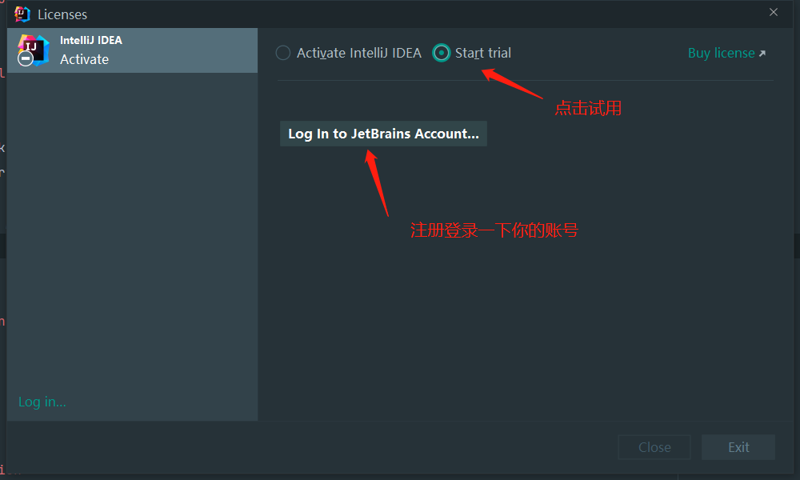 

登录后勾选试用

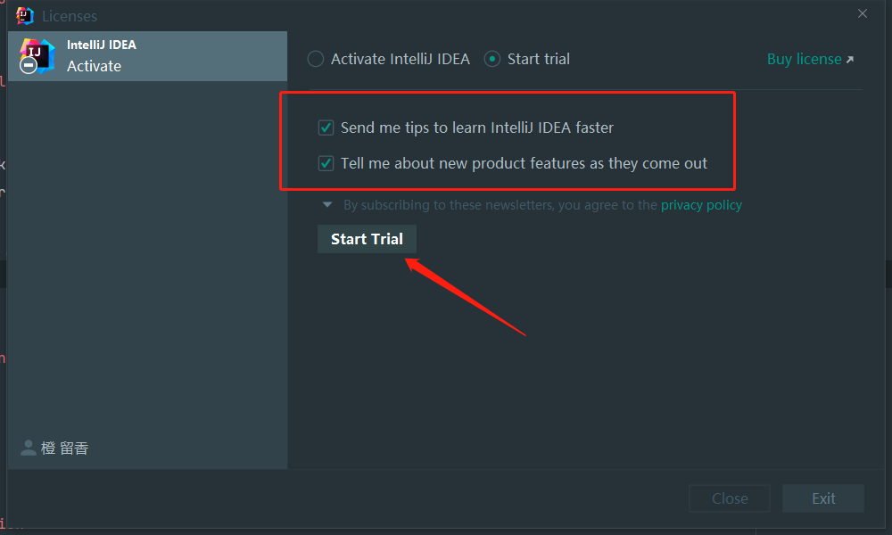 

点击试用之后发现真的是试用

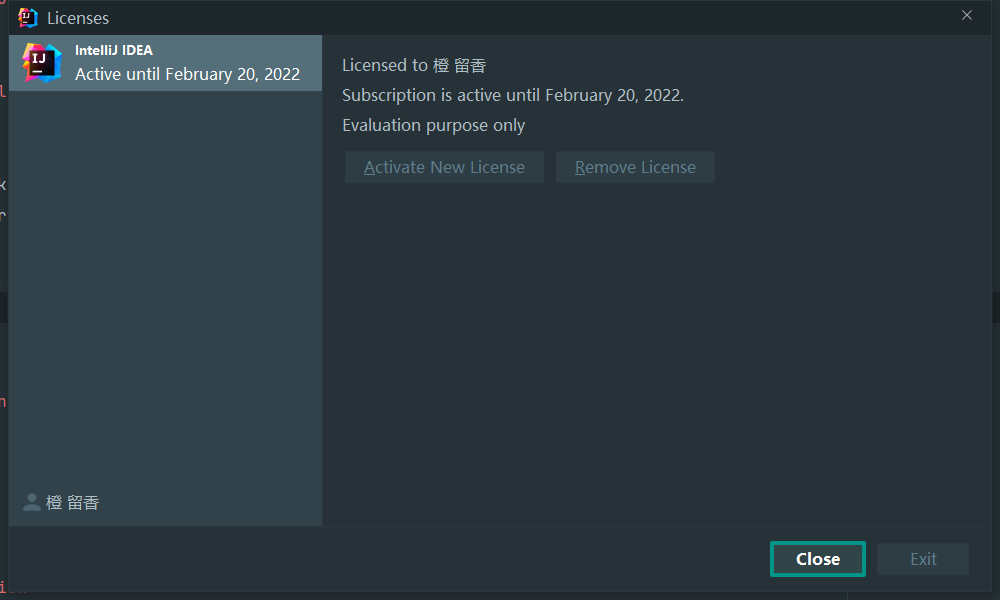 

那就去检查一下你的配置文件是否正确配置了

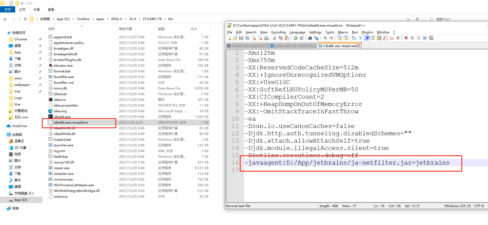 

如果配置错误（路径，单词拼写错误之类的），修改之后重新启动编辑器，发现就已经激活了

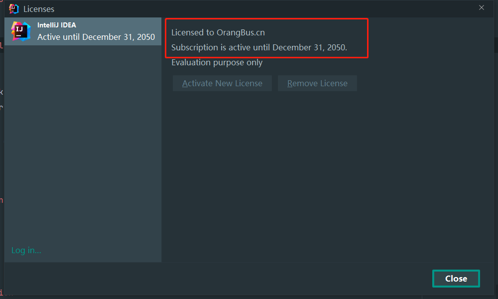 

# 自定义激活时间

进入下载文件里面的`config-jetbrains` 目录，编辑`mymap.conf`

```
[MyMap]
EQUAL,licenseeName->OrangBus.cn
EQUAL,gracePeriodDays->100000
EQUAL,paidUpTo->2050-12-31 # 自定义激活时间
```


白嫖一直爽，一直白嫖一直爽，请大家低调使用吧，向大佬致敬。

感谢作者的开源项目：https://github.com/ja-netfilter/ja-netfilter

---

QQ交流群：[【OrangBus】511300462]( https://jq.qq.com/?_wv=1027&k=aLQW6KUo) 

电报群：[https://t.me/+FOho4eXM_9gXnd0y](https://t.me/+FOho4eXM_9gXnd0y) 


