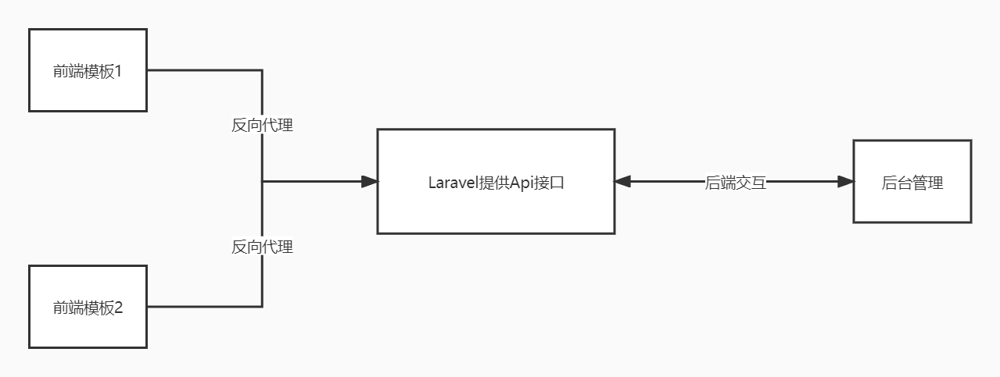

本站采用前后端分离的架构模式。

<div style="text-align:center">架构图</div>

 

整体来说至少需要两个域名：

主域名：movie.test  （部署Laravel代码）

后台管理：admin.movie.test （后台管理代码）

Ps: 由于使用了laravel的前端脚手架，所以默认的前端模板已经集成在Laravel项目中。


# 获取相关代码

OrangBus交流群：[511300462](https://jq.qq.com/?_wv=1027&k=5UQXtUm) 

环境要求：

nginx:1.2x+

php: 8.0+ (依赖redis扩展)

mysql: 5.7+

redis: 6.0+

composer 2.0+

# 一、Laravel 部署

域名：movie.test 

## 1、下载源代码

群里找群主拉你进github开发组

```
git clone https://github.com/xxx/laravel.git
```

## 2、安装

进入项目目录

```
cd laravel
```

安装扩展已经前端依赖

```bash
composer install && npm install

# 打包
npm run build
```

配置nginx 伪静态, 展示核心地方

```nginx
location / {
    try_files $uri $uri/ /index.php$is_args$args;
    autoindex off;
}
```

复制一个配置文件，填写好对应的mysql，redis数据库信息

```bash
cp .env.example .env
```

如果没有使用elasticsearch，请将下面的配置设置为false

```env
ENABLE_JOKE_SEARCH=false # 是否开启【段子】搜索
ENABLE_ARTICLE_SEARCH=false # 是否开【文章】启搜索
ENABLE_MOVIE_SEARCH=false # 是否开启【视频】搜索
```

初始化数据

根目录下有一个`start.sh` 脚本，授权执行一下就可以

```
chmod a+x start.sh

bash start.sh
```

` 选择1`，初始一下数据路等基本信息，最后将后面显示的 CLIENT_ID，CLIENT_SECRET 配置到对应的`.env` 文件中

至此后台安装完毕。

## 二、后台管理部署

域名：admin.movie.test 

得到源代码后，解压到网站的根目录，配置nginx反向代理

```nginx
location / {
    try_files $uri $uri/ /index.html;
}

location /admin {
    proxy_pass http://movie.test; # 设置你自己的laravel项目的域名或者ip
}
```


# 后续

模板2

仓库地址：[https://github.com/orangbus/movie-web](https://github.com/orangbus/movie-web) 

项目地址有详细配置说明，参考即可


集成elasticsearch搜索

后期出一个教程吧，如果大家感兴趣可以查看一下这个仓库，可快速搭建一个elk的环境

[https://gitee.com/orangbus/docker-elk-stack](https://gitee.com/orangbus/docker-elk-stack) 


