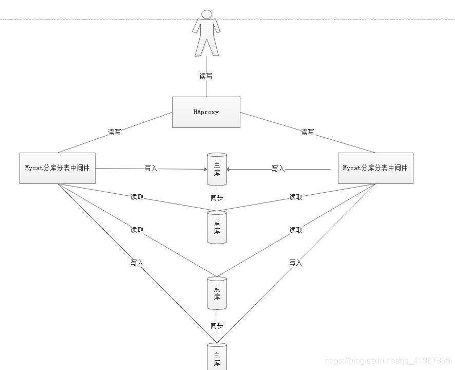

# 架构图

 

# 安装

```bash
docker pull haproxy
```

## 配置文件

配置文件名：haproxy.cfg

可参考：https://zhangge.net/5125.html

```cfg
#configure haproxy.cfg

global
	#工作目录
	chroot /usr/local/etc/haproxy
	#日志文件，使用rsyslog服务中local5日志设备（/var/log/local5），等级info
	log 127.0.0.1 local5 info
	#守护进程运行
	daemon

defaults
	log	global
	mode	http
	#日志格式
	option	httplog
	#日志中不记录负载均衡的心跳检测记录
	option	dontlognull
    #连接超时（毫秒）
	timeout connect 5000
    #客户端超时（毫秒）
	timeout client  50000
	#服务器超时（毫秒）
    timeout server  50000

#监控界面
listen  admin_stats
	#监控界面的访问的IP和端口
	bind  0.0.0.0:1080
	#访问协议
    mode        http
	#URI相对地址
    stats uri   /admin
	#统计报告格式
    stats realm     Global\ statistics
	#登陆帐户信息
    stats auth  admin:admin666
#数据库负载均衡
listen  proxy-mysql
	#访问的IP和端口
	bind  0.0.0.0:3320
    #网络协议
	mode  tcp
	#负载均衡算法（轮询算法）
	#轮询算法：roundrobin
	#权重算法：static-rr
	#最少连接算法：leastconn
	#请求源IP算法：source
    balance  roundrobin
	#日志格式
    option  tcplog
	#在MySQL中创建一个没有权限的haproxy用户，密码为空。Haproxy使用这个账户对MySQL数据库心跳检测
    option  mysql-check user haproxy
    server  MySQL_1 172.28.0.2:3306 check weight 1 maxconn 2000
    server  MySQL_2 172.28.0.3:3306 check weight 1 maxconn 2000
	server  MySQL_3 172.28.0.4:3306 check weight 1 maxconn 2000
	#使用keepalive检测死链
    option  tcpka
```

## 创建容器

```
docker run -it -d
-p 4001:8888 -p 4002:3306
-v /${pwd}/config/haproxy:/user/local/haproxy
--name haproxy --privileged
--net=net1 # 这里的网络需要和docker-pxc集群的网络是一样的，这样才能通信
haproxy

// 进入haproxy容器启动haproxy
haproxy -f paht/to/haproxy.cfg
```


## haproxy连接

Port：4002

web：8888

## 心跳检测

创建一个没有权限的用户，用于haproxy的心跳检测使用

```
CREATE USER 'haproxy'@'%' identified BY '';
```


# 数据库热备份

xtrabackup

备份数据卷

```
docker volume create backup
```

停止某个节点

```
docker stop node1
```

删除这个容器

```
docker rm node1
```

虽然删除了这个容器，但是这个容器的数据库我们已经做了持久化存储了，当我们在重新启动一个容器加入到pxc集群的时候，只需要指定之前的node1的数据卷，name之前的数据依旧是存在的

```
docker run -d 
-p 3306:3306
-e MYSQL_ROOT_PASSWORD=123456
-e CLUSTER_NAME=PXC
-e XTRABACKUP_PASSWORD=123456
-v v1:/var/lib/mysql # 指定之前删除的那个容器的数据款
-v backup:/data # 新增的备份数据卷
--privileged
-e CLUSTER_JOIN=node2 # 加入到pxc集群里面的任意一个节点
--name=node1 --net=net1
--ip=172.18.0.2 pxc

```

## 安装xtraback

在容器中安装备份工具

```
apt-get intall percona-xtrabackup-24
```

备份数据

```
innobackupex --user=root --password=123456 /data/back/full
```

数据还原

先删除之前的pxc集群，重新新建一个pxc集群

```
rm -rf /var/lib/mysql/*
```

提交为执行完的事务

```
innobackupex --user=root --password=123456 --apple-back /data/baclup/full/2021-01-01
```

冷备份

```
innobackupex --user=root --password=123456 --copy-back /data/baclup/full/2021-01-01
```


## keepalived

### haproxy安装

```bash
apt-get update

apt-get install keeplived
```


### 配置文件

> /etc/keepalived/keepalived.conf

主服务

````
````


备用

```
```


启动

```bash
service keepalived start
```

## 负载均衡-HAProxy

HAProxy提供高可用性、负载均衡以及基于TCP和HTTP应用的代理，支持虚拟主机，它是免费、快速并且可靠的一种解决方案,包括Twitter，Reddit，StackOverflow，GitHub在内的多家知名互联网公司在使用。HAProxy实现了一种事件驱动、单一进程模型，此模型支持非常大的并发连接数。

### 3.5.1 安装HAProxy

```
//下载依赖包
yum install gcc vim wget
//上传haproxy源码包
//解压
tar -zxvf haproxy-1.6.5.tar.gz -C /usr/local
//进入目录、进行编译、安装
cd /usr/local/haproxy-1.6.5
make TARGET=linux31 PREFIX=/usr/local/haproxy
make install PREFIX=/usr/local/haproxy
mkdir /etc/haproxy
//赋权
groupadd -r -g 149 haproxy
useradd -g haproxy -r -s /sbin/nologin -u 149 haproxy
//创建haproxy配置文件
mkdir /etc/haproxy
vim /etc/haproxy/haproxy.cfg
```

### 3.5.2 配置HAProxy

### 配置文件路径：/etc/haproxy/haproxy.cfg

```
#logging options
global
	log 127.0.0.1 local0 info
	maxconn 5120
	chroot /usr/local/haproxy
	uid 99
	gid 99
	daemon
	quiet
	nbproc 20
	pidfile /var/run/haproxy.pid

defaults
	log global
	
	mode tcp

	option tcplog
	option dontlognull
	retries 3
	option redispatch
	maxconn 2000
	contimeout 5s
   
     clitimeout 60s

     srvtimeout 15s	
#front-end IP for consumers and producters

listen rabbitmq_cluster
	bind 0.0.0.0:5672
	
	mode tcp
	#balance url_param userid
	#balance url_param session_id check_post 64
	#balance hdr(User-Agent)
	#balance hdr(host)
	#balance hdr(Host) use_domain_only
	#balance rdp-cookie
	#balance leastconn
	#balance source //ip
	
	balance roundrobin
	
        server node1 127.0.0.1:5673 check inter 5000 rise 2 fall 2
        server node2 127.0.0.1:5674 check inter 5000 rise 2 fall 2

listen stats
	bind 172.16.98.133:8100
	mode http
	option httplog
	stats enable
	stats uri /rabbitmq-stats
	stats refresh 5s
```

### 启动HAproxy负载

```
/usr/local/haproxy/sbin/haproxy -f /etc/haproxy/haproxy.cfg
//查看haproxy进程状态
ps -ef | grep haproxy

访问如下地址对mq节点进行监控
http://172.16.98.133:8100/rabbitmq-stats
```

代码中访问mq集群地址，则变为访问haproxy地址:5672


