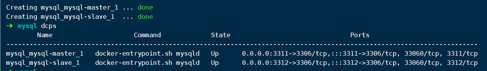
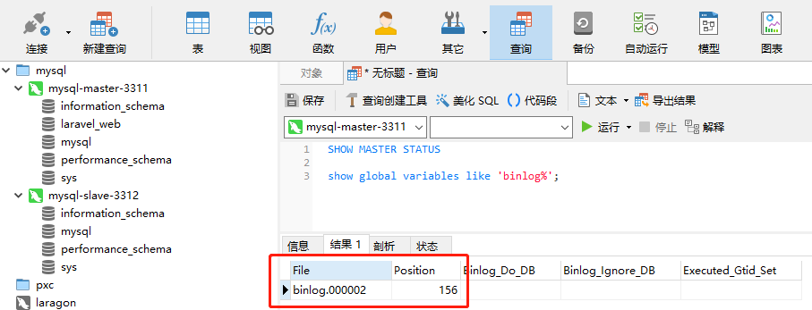
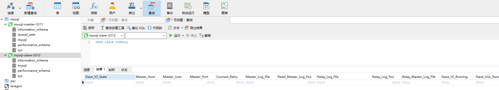
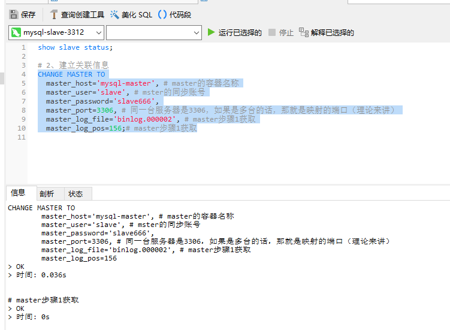
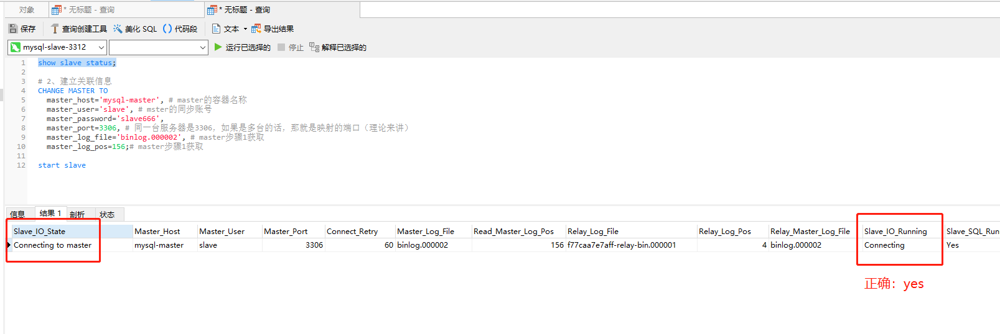
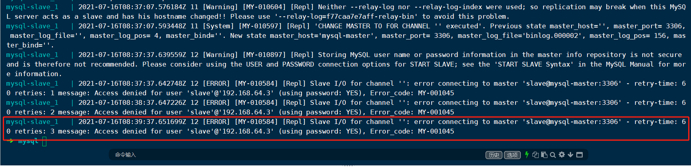
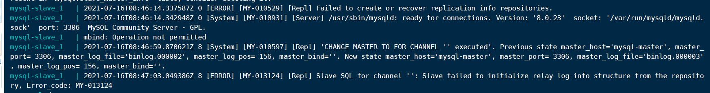

# 主从复制

配套仓库地址：[https://gitee.com/orangbus/mysql-cluster](https://gitee.com/orangbus/mysql-cluster) 

简单说就是：同时有两个mysql数据库服务，主服务（master）,从服务（slave），往master中写入的数据，slave会将master写入的数据同步到slave自己的服务器上，所以可以做读写分离的架构。

我的别名配置

```
# vim ~/.zshrc
# ============= Base =============================
alias cls="clear && ls"
alias RM='rm -rf'
alias ll='ls -alh'
# ============== docker ==========================
alias dc='docker-compose'
alias dca='dc up -d nginx phpmyadmin'
alias dcps='docker-compose ps'
alias dcres='docker-compose restart && dcps'
alias dcn='docker-compose restart nginx && dcps'
alias dcd='dc down'
```

## 启动服务

```bash
dc up -d
```

查看是否启动成功

```
dcps 
```

  

## 一、主服务配置-master

### 1、master连接测试

```
# 查看master状态
SHOW MASTER STATUS
```

 


获取到这两个信息，slave需要用到

### 2、创建同步用户，并授权

默认会创建一个用户，配置在当前文件的 `.env` 中

```
# 创建一个同步的用户，该用户数据master节点，
CREATE USER 'slaveuser'@'%' IDENTIFIED WITH mysql_native_password BY '123456';

#授权用户slaveuser使用123456密码登录mysql
grant replication slave on *.* to 'slaveuser'@'%';

#刷新配置
flush privileges;
```

- 需要注意的是，连接的地址是`容器的名称`，因为是在同一台服务器上运行的，如果是多台服务器填写对应的ip地址。
- slave是当前`master服务`的用户，不是slave从服务器的用户，是`slave从服务`用于同步数据的账号。

其它命令

```
#查看二进制日志相关的配置项
show global variables like 'binlog%';

#查看server相关的配置项
show global variables like 'server%';
```

## 二、从服务配置-slave

连接进入从服务器，设置master的相关信息

### 1、slave连接测试

```
#查看slave状态
show slave status;
```

  

### 2、设置与master的关联信息

```
# 1、先停止
stop slave

# 2、建立关联信息
CHANGE MASTER TO
	master_host='mysql-master', # master的容器名称
	master_user='orangbus', # mster的同步账号
	master_password='123456',
	master_port=3306, # 同一台服务器是3306，如果是多台的话，那就是映射的端口（理论来讲）
	master_log_file='binlog.000002', # master步骤1获取
	master_log_pos=156;# master步骤1获取

# 3、启动同步
start slave
```

有时候启动同步会失败，那么可以执行一下重置

```
# 先停止
stop slave

reset slave;
```



### 3、查看是否配置成功

```
show slave status
```

# 配置文件

## master服务器

```
[mysqld]
#开启主从复制，主库的配置
log-bin=mysql-bin

#指定主库serverid
server-id=1

# 设置需要复制的数据库(可设置多个)
# binlog-do-db=test

# 设置不要复制的数据库(可设置多个)
binlog-ignore-db=sys
binlog-ignore-db=mysql
binlog-ignore-db=information_schema
binlog-ignore-db=performance_schema

# 设置logbin格式
binlog_format=mixed

# 处理报错
sql-mode="STRICT_TRANS_TABLES,NO_ZERO_IN_DATE,ERROR_FOR_DIVISION_BY_ZERO,NO_ENGINE_SUBSTITUTION"
character-set-server=utf8
```

## slave 服务器配置

```
[mysqld]
#开启主从复制，主库的配置
log-bin=mysql-bin

default_authentication_plugin=mysql_native_password

#指定主库serverid
server-id=2

#指定同步的数据库，如果不指定则同步全部数据库
# binlog-do-db=laravel

## 复制过滤：也就是指定哪个数据库不用同步（mysql库一般不同步）
binlog-ignore-db=mysql
binlog-ignore-db=sys
binlog-ignore-db=information_schema
binlog-ignore-db=performance_schema

## 主从复制的格式（mixed,statement,row，默认格式是statement）
binlog_format=mixed

## 二进制日志自动删除/过期的天数。默认值为0，表示不自动删除。
expire_logs_days=7

## 跳过主从复制中遇到的所有错误或指定类型的错误，避免slave端复制中断。
## 如：1062错误是指一些主键重复，1032错误是因为主从数据库数据不一致
slave_skip_errors=1062

# 处理报错
sql-mode="STRICT_TRANS_TABLES,NO_ZERO_IN_DATE,ERROR_FOR_DIVISION_BY_ZERO,NO_ENGINE_SUBSTITUTION"
character-set-server=utf8

```

# 问题排查

## 1、slave连接失败

 

连接失败我们就去查看一下slave容器的日志：

```
dc logs mysql-slave
```

 

从日志中我们看出，应该是密码错误了，如果你们也遇到这个错误，那就检查一下 master的`端口` `连接密码`

然后在执行 `2-2` 的步骤


## 2、不知道什么错误

 

可能是更改了配置没有生效。

连接测试 master同步的账号是否能正常连接，是在不行，删除缓存数据，重头再来一遍

```
sudo rm -rf data/mysql/*
```

## 3、同步授权失败

> mysql-slave_1   | 2021-07-16T13:32:32.656444Z 17 [ERROR] [MY-010584] [Repl] Slave I/O for channel '': error connecting to master 'orangbus@mysql-master:3306' - retry-time: 60 retries: 2 message: Authentication plugin 'caching_sha2_password' reported error: Authentication requires secure connection. Error_code: MY-002061

```
set global max_connect_errors=1000;

show global variables like '%max_connect_errors%';
```

参考链接：https://blog.csdn.net/wangbin9536/article/details/104150127

## 4、无法查看master状态信息

当我们去查看 `master` 状态的时候，显示为空，查看mysql日志发现

> Warning: World-writable config file '/etc/mysql/my.cnf' is ignored

**可能产生的原因：** my.cnf 权限过高

```bash
sudo chmod 644 my.cnf
```

## 5、踩坑指北

能复制的参数尽量复制，别手敲

# 备注

my.conf

```
# 需要同步的二进制数据库名
binlog-do-db=masterdemo

# 只保留7天的二进制日志，以防磁盘被日志占满(可选)
expire-logs-days  = 7

# 不备份的数据库
binlog-ignore-db=information_schema
binlog-ignore-db=performation_schema
binlog-ignore-db=sys
```


```
show slave status;

stop slave

# 2、建立关联信息
CHANGE MASTER TO
	master_host='mysql-master', 
	master_user='slave', 
	master_password='slave666',
	master_port=3306, 
	master_log_file='binlog.000004',
	master_log_pos=156;

start slave
```


```
global
    log         127.0.0.1 local2
    chroot      /var/lib/haproxy
    pidfile     /var/run/haproxy.pid
    maxconn     4000
    user        haproxy
    group       haproxy
    daemon
    stats socket /var/lib/haproxy/stats
defaults
    mode                    http
    log                     global
    option                  httplog
    option                  dontlognull
    option http-server-close
    option forwardfor       except 127.0.0.0/8
    option                  redispatch
    retries                 3
    timeout http-request    10s
    timeout queue           1m
    timeout connect         10s
    timeout client          1m
    timeout server          1m
    timeout http-keep-alive 10s
    timeout check           10s
    maxconn                 3000

frontend webservs
    bind *:788
    acl static path_beg -i /static /images /javascript /stylesheets
    acl static path_end -i .jpg .gif .png .css .js .html
    acl php path_end -i .php
    use_backend static if static
    use_backend dynamic if php
    default_backend dynamic

backend static
    balance roundrobin
    server sta1 192.168.253.128:6080 check maxconn 3000
    server sta2 192.168.253.128:7080 check maxconn 3000

backend dynamic
    balance source
    server dyn 192.168.253.128:7080 check maxconn 1000

```

