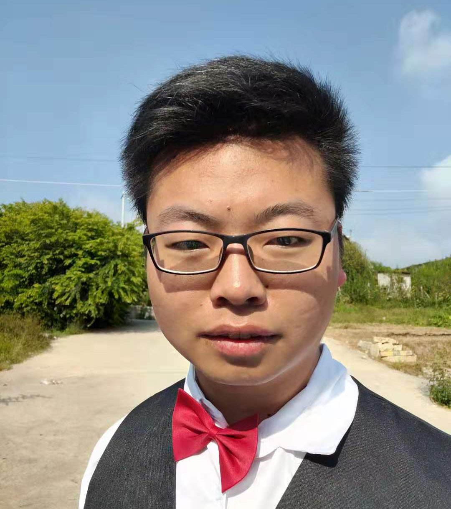

# 基本信息

李俊飞 / 男 / 汉 / <a href=tel:18388112576>18388112576</a> / 1353727504@qq.com

期望未来的工作能偏向产品方向开发及产品迭代，有明确开发方向，能接受加班，少做无用的加班工作，团队成员沟通成本低，有一个良性循环的氛围，而不是个人独大。

# 技能

1. 拥有扎实的 PHP 基础，深入理解 OOP 思想，熟悉常用的设计模式
2. 熟悉 laravel 框架，对于框架核心功能的实现具备一定的理解，并且能熟练运用脚手架提供的功能。
3. 熟悉 thinkphp6框架，可快速进行项目的独立开发。
4. 熟悉 mysql 数据库，理解 mysql 的结构与执行流程，熟悉索引优化，慢查询优化，高可用，主从复制，分库分表。
5. 熟悉 Redis nosql 数据库，能熟练使用 Redis 缓存数据。
6. 熟悉 Linux 系统，平时常用manjaro作为主力开发系统，开发环境基于laradock。
7. 熟悉 Nginx 配置优化与负载均衡配置，以及高可用架构设计和实施。
8. 熟悉 restful 风格，熟练于第三方对接开发
9. 熟悉 docker 创建容器构建镜像，能编写 dockerfile，熟练使用 docker-composer编排，对k8s有一定了解。
10. 熟悉 html，css，js，JavaScript，jQuery，layui，bootstrap，mdui，vue，uniapp等前端技术开发
11. 熟悉 git 版本控制工具，拥有良好的代码编写规范，
12. 有一定Python技术，熟悉Scrapy框架，对网站数据进行爬取保存到mysql或者mongo数据库中。
13. 有一点java和springboot基础，使用mave管理项目，mybatis-plus进行数据库查询，熟悉Thymeleaf模板引擎。
14. 开发工具：phpstorm、webstorm、pyCharm、idea，写作基于markdown

**预览** 

- 前端：Html、CSS、JS、Vue、BootStrap、MDUI、Layui、uniapp框架等
- 后端：Php、Thinkphp5、laravel、Python、Java、mysql优化、Git、Redis、MongoDb、Scrapy、elasticsearch
- 运维：Linux基本操作，熟悉web开发部署流程，docker，Lnmp、K8s，高可用架构
- 设计：PS、AI、PR、CDR、Office
- 开发环境：Manjaro | window
- Server: Debian | Centos | Ubuntu

# 工作经历

## 【2018】 某广告公司

- 基本的广告设计，成品安装。
- 常用：Ps、Ai、Cdr

## 【2019】 云南義德商贸有限公司

- 微信商城二次开发
- 服务器运维等
- 其他UI设计及管理

## 【2020 -2021】 - 领学教育

参与公司整个项目开发，项目后端采用Thinkphp6，前端采用Vue前后端分离的架构模式。

**主要模块：** 文章、点播、直播、面授、题库、自定义表单、各类营销工具等。

**主要参与模块：** 文章分享收益、题库，课程分销，自定义表单，其他营销功能开发。

---

独立设计和开发一些小功能的系统，有系统内部的表单审核，独立自定义表单功能。

**昆明民办教育协会** 官网开发，使用的最新laravel8进行开发。

# 教育背景

云南国防工业职业技术学院 / 建筑工程技术 / 专科 

# 自我评价

- 3年以上 PHP 后端实际工作研发经验，2 年在校 自学PHP ；注重自我学习和提升；
- 良好的代码规范，习惯性的代码注释和保持代码的简洁易读；
- 具有良好的研发、产品、运营等多种思维方式来考虑问题；
- 乐于沟通和分享，并且是技术爱好者、开源爱好者、社区分享者，总结工作中遇到的问题及解决方案；
- 乐于尝试和钻研新的技术，喜欢把研究的新技术在团队推广分享和使用；
- 能够很快的融入团队，带动团队整体氛围，积极乐观，勇于挑战困难；
- 坚持学习，了解新的技术，不断提高个人能力。

# 个人简介

高中之前不知道自己都干了些啥，和基本往常一样。

&nbsp;&nbsp;&nbsp;&nbsp;由于高考成绩不理想，离二本还差那么几分，于是选择了专科,当初也不知道报什么专业，错打误撞被建筑专业选中，大学也是一个神奇的地方。课余时间没事就喜欢折腾一下电脑，从最基础的安装系统开始，折腾了一个学期，后来了解到了html，于是就顺着学习下来，虽然学习旅程很艰辛，也不知道学了有什么用，但是慢慢的就喜欢上这些东西，不断学习不断入坑。

- 大学期间曾运营过一个自己的微信公众号，做了一个学期，大约有快800人的粉丝，后面由于种种原因被封禁了。
- 大二跟朋友一起开发运营过一个租车平台的商城。
- 大学期间曾担任社团的媒体代表，负责社团的海报设计和一些宣传活动。

大学毕业了给我留下最多的也就是自己课余学习的这些知识吧。

&nbsp;&nbsp;&nbsp;&nbsp;大学即使教不会你很多东西，但是让你学会了成长。虽然只是一个普通的学校，但是来到大学还是一件幸运的事，在大学期间，我结识了一群比较坑的舍友，毕业了老师虽然不能把他想教给我们的知识教给我们，但是在大学的这段时间，他启迪了我很多东西，我学会如何管理自己，如何去不断提升自己的能力。

总之，我就是一个热爱编程，勤动手善于实践，爱折腾，热情开朗的一个人。

# 社交主页

个人博客：[https://doc.orangbus.cn](https://doc.orangbus.cn) 

Gitee：[https://gitee.com/orangbus](https://gitee.com/orangbus) 

Github：[https://github.com/orangbus](https://github.com/orangbus) 

 发现生活，改变自己，生命不息，折腾不止。 

