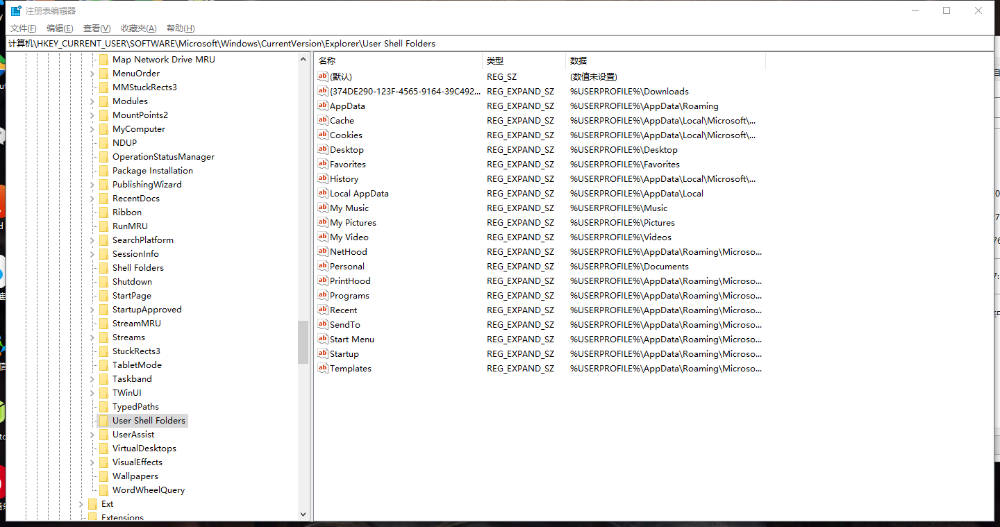
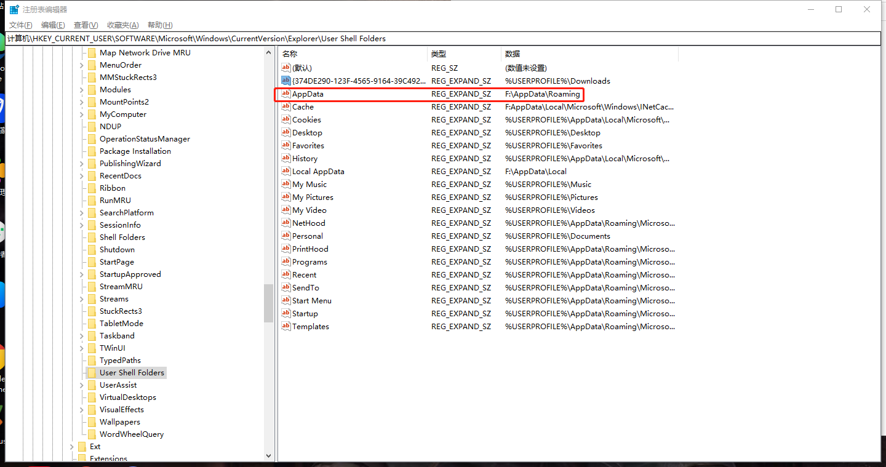

---

sidebar: auto
title: windows
desc: 下载 ，资源 ， 电脑辅助工具 ， 动态桌面 ， 录屏
keyword: 下载工具 ，资源 ， 电脑辅助工具 ， 动态桌面 ， 录屏，电脑辅助工具，视频下载，免费ppt，素材
date: 2019-06-04 14:56:23

---

## 在线工具
【Airmore】手机投屏：<http://web.airmore.com>

【DogeDoge】一款不追踪你的搜索引擎:<https://duckduckgo.com>

【秘迹】不追踪 你的搜索引擎:<https://mijisou.com>

### 在线文档：
【QQ】在线协同工具：<https://doc.qq.com>

【松果文档】在线协同工具：<https://drive.sg.work>

【金山文档】在线协同工具：<https://plus.wps.cn/docService>

### 文件传输：
【文叔叔】在线文件传送：<http://wenshushu.cn>

【SwndanyWhere】: <https://send-anywhere.com/>

【奶牛快传】:<https://cowtransfer.com/>

【BitSend】:<https://bitsend.jp/?setLang=en>

## 下载神器
【IMD】下载神器网址 **(推荐使用)**：<https://www.internetdownloadmanager.com>

【Eagleget】下载器 **(推荐使用)**：<http://www.eagleget.com>

【PanDownload】 **(推荐使用)**: <https://pandownload.com>

【速盘】-百度网盘下载工具 **(推荐使用)** ：<https://www.speedpan.com/>


## 电脑辅助工具
【Listary】文件查找&快速启动 **(推荐使用)**：<http://www.listary.com>

【Everything】文件搜索 **(推荐使用)**：<https://www.voidtools.com/downloads>

【Wox】文件查找&快速启动：<http://www.getwox.com>

【RaiDrive】网盘映射 **(推荐使用)**：<https://www.raidrive.com/download>

【bandizip】智能解压工具 **(推荐使用)**：<https://www.bandisoft.com/bandizip/cn>

【7-zip】免费开源压缩工具：<http://www.7-zip.org>

【Snipaste】超好用的截图软件：<https://zh.snipaste.com>

【火萤桌面】（可以将视频设置为壁纸）：<http://huoying666.com>

【OBS】跨平台录屏软件：<https://obsproject.com>

【CC助手】复制两次，一键收藏：<https://ccyixia.com>

## 远程工具
【Teamview】优秀的远程连接工具 **(推荐使用)**: <https://www.teamviewer.com/zhCN/>

【AnyDesk】优秀的远程连接工具: <https://anydesk.com/remote-desktop>

## 写作软件
Markdown-Typora **(推荐使用)**：<https://typora.io/>

VScode微软编辑器：<https://code.visualstudio.com/>

NotePad++：<https://notepad-plus-plus.org/>（官网有点卡，可以自己百度）
## Chrome插件
插件管理：[Google Store](https://chrome.google.com/webstore/detail/extension-manager/gjldcdngmdknpinoemndlidpcabkggco)

去广告：[Google Store](https://chrome.google.com/webstore/detail/%E5%B9%BF%E5%91%8A%E7%BB%88%E7%BB%93%E8%80%85/fpdnjdlbdmifoocedhkighhlbchbiikl)

## PPT提升篇
Islide : <https://www.islide.cc>

PA口袋动画：<http://www.papocket.com/index.html>

PPT美化大师：<http://meihua.docer.com>

动画演示大师（单独制作软件，挺不错的）：<http://www.focusky.com.cn>

推荐几个免费好看的PPT模板网站

第一PPT ： <http://www.1ppt.com/>
office plus （微软官网提供）：<http://office.mmais.com.cn/Template/Home.shtml>

优品PPT ： <http://www.ypppt.com>

PPTOK : <http://www.pptok.com>

声享PPT（制作） ：<https://ppt.baomitu.com>

## 素材网站推荐
照片分享网站：<https://www.pexels.com/>

柚子素材：<https://www.yozsc.com/>

千图网：<http://www.58pic.com>

花瓣网：<http://huaban.com>

觅元素：<http://www.51yuansu.com/>

阿里巴巴矢量图：<http://www.iconfont.cn>

摄图网：<http://699pic.com>

千库网：<http://588ku.com>

图虫网：<https://tuchong.com>

## Windows Terminal默认打开路径

```json
{
    // Make changes here to the powershell.exe profile.
    "guid": "{61c54bbd-c2c6-5271-96e7-009a87ff44bf}",
    "name": "Windows PowerShell",
    "commandline": "powershell.exe",
    "hidden": false,
    "startingDirectory" : "d:/laragon/www/", //这里配置默认启动的位置
},
```

Windows Terminal中WSL默认打开路径(startingDirectory)

```
"startingDirectory": "//wsl$/Ubuntu-20.04/home/baiguo",
```

## Cmd 打开当前文件夹

```bash
start .

explorer .
```

Ps: 仔细看后面是有一个点的

## Window10-11官方下载

window10：<https://www.microsoft.com/zh-cn/software-download/windows10ISO>

window11: [https://www.microsoft.com/zh-cn/software-download/windows11](https://www.microsoft.com/zh-cn/software-download/windows11) 

> 如果你有更好的资源，请联系我！
> 其实我收藏了太多了，懒得整理了，以后关注的人多了在说吧！

## window git别名

```bash
# cd
# vim .bashrc

alias cls='clear && ls'
alias la='ls -a'

alias web="cd /d/laragon/www"
```

重载配置

```bash
source .bashrc
```

## 微信多开

```
# wechat.bat

start "" "D:\Program Files (x86)\Tencent\WeChat\WeChat.exe"
start "" "D:\Program Files (x86)\Tencent\WeChat\WeChat.exe"
```

## 清理C盘的3种办法

## 1、使用电脑管家快速清理

## 2、转移C盘安装软件到其他盘

# 3、修改C盘 appData 位置

```
计算机\HKEY_CURRENT_USER\SOFTWARE\Microsoft\Windows\CurrentVersion\Explorer\User Shell Folders
# 以及
计算机\HKEY_CURRENT_USER\SOFTWARE\Microsoft\Windows\CurrentVersion\Explorer\Shell Folders
```

 

修改后

 

接着把 `C:\Users\$USER$\AppData` 复制到你自定义为位置，重启电脑即可

对于c盘的文件，你可以查看你改动过的目录，把对应的目录文件删除即可，其他没有改动的文件就保持原来的。
